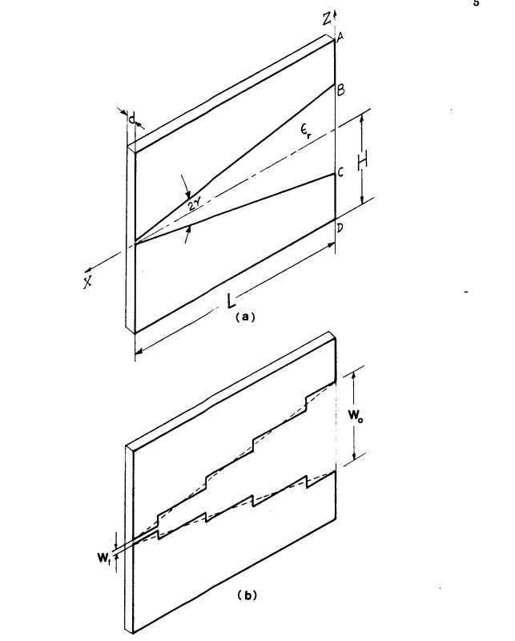

> 먼저 필자는 "vivaldi Antenna" 설계를 위해 해당 자료를 공부하고 있음을 미리 언급한다...

## 📡  Introduction

일반적으로 널리 쓰이는 인쇄형 다이폴, 마이크로스트립 패치 같은 안테나는 주로 수직 방향(broadside)으로 전파를 쏘아냅니다. 하지만 이런 안테나들은 기본적으로 이득(gain)이 낮아, 12°~60° 수준의 좁고 예리한 빔폭이 필요한 시스템에는 한계가 있었습니다.

이러한 한계를 극복하기 위해 등장한 해결책이 바로 **진행파 안테나(Travelling wave antennas)** 이며, 그중에서도 오늘 소개할 **테이퍼형 슬롯 안테나(Tapered Slot Antenna, TSA)** 가 대표적입니다.

 - 진행파 안테나 : wave가 guiding structure를 따라 진행하는 안테나

### 1. 테이퍼형 슬롯 안테나(TSA)란 무엇인가?
TSA는 얇은 금속막(때로는 얇은 유전체 기판이 부착된 형태)에 슬롯을 파낸 구조를 가집니다. 안테나의 한쪽 끝은 믹서 다이오드(mixer diodes) 같은 소자와 효율적으로 결합하기 위해 폭이 좁고, 반대 방향으로 갈수록 폭이 점진적으로 넓어지는(tapered) 형태를 띱니다. 전파는 이 슬롯을 따라 이동하다가 폭이 넓어지는 구간에서 **안테나의 정면(end-fire) 방향으로 방사**됩니다. 

이러한 특징 덕분에 TSA는 집적 회로, 이미징 시스템, 위상 배열(phased arrays) 안테나 등 다양한 분야에서 매우 유용하게 활용됩니다.

### 2. TSA의 대표적인 종류
테이퍼가 넓어지는 모양에 따라 여러 가지 이름으로 불리며 발전해 왔습니다.

*   **비발디 안테나 (Vivaldi Antenna):** 1979년 Gibson이 제안한 모델로, 슬롯의 폭이 **지수 함수형(exponential)** 으로 곡선을 그리며 넓어지는 안테나입니다
*   **선형 테이퍼형 안테나 (LTSA - Linearly Tapered Slot Antenna):** Prasad와 Mahapatra가 도입한 모델로, 슬롯의 폭이 직선으로 **선형적(linear)** 으로 넓어집니다. Korzeniowski 등은 이 LTSA를 배열해 94 GHz 대역의 이미징 시스템을 개발하기도 했습니다.
*   **균일폭 슬롯 안테나 (CWSA - Constant Width Slot Antenna):** Yngvesson 등이 실험 결과를 발표한 형태로, 테이퍼 구간 이후 **일정한 폭(constant width)** 을 유지하는 구조입니다.

### 3. 왜 TSA에 주목해야 할까? (그리고 기존의 한계점)
TSA는 평면형 구조임에도 불구하고 **대칭적인 메인 빔(main beam)을 생성할 수 있고, 패턴 대역폭이 매우 넓다는 강력한 장점**을 지닙니다.

### 이론의 부재
그동안 이 훌륭한 안테나를 설계할 때, 명확한 이론이 없어 엔지니어들의 '경험적 수치(empirical designs)'에 전적으로 의존해야만 했습니다. 안테나의 길이, 테이퍼의 모양, 유전체 기판의 종류와 두께 등 구조적 변수가 방사 패턴에 어떤 영향을 미치는지 정확히 예측할 수 있는 이론적 모델이 절실히 필요했습니다,.

### 4. 새로운 이론적 모델의 탄생 (본 연구의 목표)
본 연구(논문)의 목적은 바로 이 TSA의 방사 특성을 완벽하게 예측할 수 있는 **포괄적인 이론적 모델을 개발**하는 것입니다. 

*   부드러운 곡선을 가진 임의의 테이퍼 모양에 모두 적용할 수 있는 범용적인 모델을 제시합니다.
*   일정 폭(CWSA), 선형(LTSA), 지수형(Vivaldi) 등 다양한 형태와 유전체 파라미터를 가진 안테나 실험 결과를 통해 모델의 타당성을 검증합니다.
*   더불어, 안테나의 측면 크기(lateral dimension)가 방사 패턴에 미치는 새롭게 관찰된 흥미로운 실험적 현상까지 함께 분석하여 제시합니다,.

*** 

## Method of Analysis
이론적 모델의 정성적인 전개 과정을 제시해보자. 이론에 포함되는 주요 단계들을 요약하고 채택한 모델이 필요한 이유를 설명할 수 있다.

아래 그림의 (a)은 선형 테이퍼 슬롯 안테나의 형상을 나타낸다. 금속 패턴은 기판의 한쪽 면에만 존재한다. 이 안테나는 엔드파이어(end-fire) 방향, 즉 음의 x축 방향으로 방사한다. 방사되는 전기장은 선형 편파를 가지며, 슬롯의 평면과 평행하다.

     
    <em>그림 1. LTSA (a)와 균일 슬롯 라인 근사 (b)</em>

이 안테나는 일반적으로 얇고 낮은 유전율을 갖는 기판 위에 식각되며, 길이는 보통 3$\lambda_0$ ~ $10\lambda_0$ 정도로 제작된다.($\lambda_0$는 자유공간에서의 파장)

잘 형성된 방사패턴은 횡방향 치수 $H$가 전기적으로 매우 작거나, 또는 전기적으로 매우 클 때 얻을 수 있다.(전기적으로 매우 작거나 크다는 말은 파장에 대해 비교한 결과를 의미합니다.) 이 후의 해석에서는 H가 매우 크다고 가정하며, 따라서 무한히 큰 값으로 간주한다.

- H가 전기적으로 매우 작은 경우($H ≪ \lambda$): 구조 전체가 파장에 비해 작기 때문에 횡방향 가장자리에서 생기는 위상차이가 크지 않음.(복잡한 횡방향 모드나 가장자리 회절이 크게 발달하지 않음)

- H가 전기적으로 매우 큰 경우($H ≫ \lambda$) : 슬롯 근처에서 발생한 장이 옆 가장자리까지 가더라도, 가장자리가 너무 멀리 있기 때문에 슬롯 주변의 주 방사 메커니즘에 거의 영향을 주지 않음(중앙 슬롯 입장에서 옆 경계가 사실상 없는 것처럼 보임)

해석 방법은 두 단계로 구성된다.

첫번째 단계에서는 테이퍼 슬롯 내부의 접선 방향 전기장 분포를 구한다. 이후 이 전기장 분포를 개구면 분포(aperture distribution)라고 부른다.

두 번째 단계에서는 슬롯에 존재하는 등가 자기 전류에 의해 반사되는 원거리장을 적절한 그린 함수(Green's function)을 사용하여 구한다.

위 그림과 같이 원래 테이퍼 슬롯은 폭이 연속적으로 변한다.

$$W_s(x) = position에\ 따라\ 연속적으로\ 변화$$

그런데 연속적인 구조를 그대로 풀긴 어렵기 때문에 여러개의 짧은 균일 슬롯 라인으로 나눈다.(그림 1.(b))

$$폭\ W_1 \rightarrow 폭\ W_2 \rightarrow 폭\ W_3 \rightarrow ⋯ \rightarrow 폭\ W_N$$
각 구간은 폭이 일정하므로 그 구간의 특성 임피던스와 슬롯 파장을 계산할 수 있다.

$$Z_0 = Z_0(W_s)$$

$$\lambda_s = \lambda_s(W_s)$$

그리고 구간이 바뀌는 지점에서 임피던스가 조금씩 바뀌므로 작은 반사가 생성된다.
$$\Gamma_n = \frac{Z_{n+1} - Z_n}{Z_{n+1} + Z_n}$$
테이퍼가 완만하면 $Z_{n+1}$과 $Z_{n}$의 차이가 작기 때문에 
$$|\Gamma_n| ≪ 1$$
가 됩니다. 따라서 **"small reflction theory"** 를 활용할 수 있습니다.

이제 슬롯을 여러 구간으로 쪼개서 균일 슬롯 라인으로 만들었으므로 그 구간의 전계 분포는 균일 슬롯라인의 해로부터 구할 수 있게됩니다. 균일 슬롯라인의 고유모드의 해를 구하면 보통 전계의 형상을 알 수 있는데 예를 들어 어떤 슬롯의 전계가 
$$E_n(y) = A_ne_n(y)$$
처럼 나온다고 하면 여기서 $e_n(y)$는 그 구간의 모드 형상이되지만 $A_n$은 아직 미정이다. 하지만 균일 슬롯 라인 하나만 고려하면 $A_n$은 입력 전력에 따라 정해지는 단순한 크기 상수 즉 곱셈 상수(mulitplicative constant)가 된다.
하지만 계단형 테이퍼에서는 각 구간마다
$$A_1, A_2, A_3, ⋯ A_N$$
이 다를수 있기 때문에 이 상수들을 서로 연결해야지 전체 aperture distribution을 알 수 있다.

이때 각 구간의 미정 상수 $A_n$을 연결하기 위해 사용하는 조건이 **전력 연속 조건(power continuity criterion)** 이다. 말 그대로 계단 접합부에서 전력이 갑자기 생기거나 사라지지 않는다고 가정하는 것이다.

즉, n번째 구간과 n+1번째 구간 사이의 접합부에서 
$$P_n=P_{n+1}$$

이 성립한다고 둔다.

전송선 이론에서 전력은 전압과 특성 임피던스를 이용해 대략 다음과 같이 표현할 수 있다.

$$P=\frac{1}{2}\frac{|V|^2}{Z_0}$$

슬롯라인에서는 슬롯을 가로지르는 전기장이 전압과 유사한 역할을 하므로, 각 구간의 전력은 전계 크기 상수 $A_n$과 특성 임피던스 $Z_{0,n}$ 을 이용해 다음과 같은 형태로 생각할 수 있다.

$$P_n \propto \frac{|A_n|^2}{Z_{0,n}}$$

따라서 전력 연속 조건을 적용하면
	
$$\frac{|A_n|^2}{Z_{0,n}}=\frac{|A_{n+1}|^2}{Z_{0,n+1}}$$

이 되고, 여기서 각 구간의 전계 크기 상수 사이의 관계를 얻을 수 있다.
$$|A_{n+1}|=|A_n|\sqrt{\frac{Z_{0,n+1}}{Z_{0,n}}}$$
	

즉, 슬롯 폭이 바뀌면서 특성 임피던스 $Z_0$가 바뀌고, 그에 따라 같은 전력이 흐르도록 전계의 크기 $A_n$도 조정된다. 이 과정을 모든 계단 구간에 대해 반복하면

$A_1 \rightarrow A_2 \rightarrow A_3 \rightarrow \cdots \rightarrow A_N$

의 관계를 얻을 수 있으며, 결과적으로 전체 계단형 테이퍼 구조에서의 aperture distribution을 구성할 수 있다.

정리하면, 균일 슬롯라인의 해는 각 구간에서의 전계 모양을 알려주고, 전력 연속 조건은 구간과 구간 사이의 전계 크기를 연결해준다.

따라서 계단형 테이퍼 슬롯의 전체 전계 분포는 다음과 같이 이해할 수 있다.

$$E_{\text{ap}}(x,y)=A_n e_n(y),\qquad x_n < x < x_{n+1}$$
	

은 n번째 균일 슬롯라인 구간을 의미한다. 즉, 각 구간 안에서는 균일 슬롯라인의 모드 형상 $e_n(y)$을 따르고, 구간이 바뀔 때마다 전력 연속 조건에 의해 결정된 $A_n$이 적용된다.

이렇게 얻은 aperture distribution은 이후 원거리 방사장을 계산하는 입력으로 사용된다. 즉, 첫 번째 단계에서는 슬롯 내부의 전계 분포를 구하고, 두 번째 단계에서는 이 전계 분포가 실제로 어떤 방사 패턴을 만드는지 계산한다.

슬롯 안의 전기장은 등가 원리에 의해 등가 자기 전류(equivalent magnetic current)로 바꾸어 생각할 수 있다.
$$\mathbf{M}_s = -2\hat{n} \times \mathbf{E}_{\text{ap}}$$
	

즉,

$$\text{slot electric field}
\rightarrow
\text{equivalent magnetic current}
\rightarrow
\text{far-field radiation}$$

의 순서로 해석이 진행된다.

여기서 중요한 점은 LTSA나 비발디 안테나에서는 슬롯이 금속면의 끝단까지 이어진다는 것이다. 따라서 단순히 무한히 큰 접지면에 있는 슬롯으로 해석하면 end-fire 방향의 방사를 제대로 설명할 수 없다. 실제로 슬롯 끝단의 금속 모서리에서는 회절이 발생하고, 이로 인해 edge-induced current가 생긴다.

이 edge-induced current는 특히 E-plane 패턴과 end-fire 방사에 큰 영향을 준다. 그래서 논문에서는 자유공간 Green’s function이 아니라, 도체 반평면의 모서리 효과를 포함할 수 있는 half-plane Green’s function을 사용한다.

결국 전체 해석 흐름은 다음과 같이 정리할 수 있다.
$$\text{continuous tapered slot} \newline
\downarrow \newline
\text{stepped uniform slot-line sections} \newline
\downarrow \newline
\text{eigenmode solution of each section} \newline
\downarrow \newline
\text{power continuity condition} \newline
\downarrow \newline
\text{aperture distribution} \newline
\downarrow \newline
\text{equivalent magnetic current} \newline
\downarrow \newline
\text{half-plane Green's function} \newline
\downarrow \newline
\text{far-field pattern}$$

요약하면, 이 모델은 테이퍼 슬롯 안테나를 직접 풀기 어려우므로 먼저 여러 개의 균일 슬롯라인으로 나누고, 각 구간의 모드 해와 전력 연속 조건을 이용해 슬롯 내부 전계 분포를 구한다. 이후 이 전계 분포를 등가 자기 전류로 바꾸고, 금속 모서리에서 발생하는 회절 효과까지 포함하여 원거리 방사장을 계산한다.

이 관점에서 보면 비발디 안테나는 단순히 “지수형 슬롯을 가진 안테나”가 아니라, 테이퍼 슬롯을 따라 진행하는 전계 분포와 금속 모서리에서의 회절 효과가 함께 end-fire 방사를 형성하는 진행파 안테나라고 이해할 수 있다.