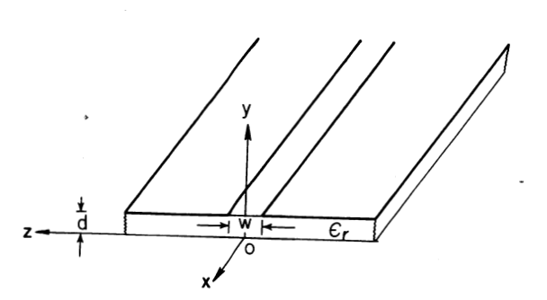

# Low-permittivity substrate 위의 균일 슬롯라인 해석
이전 게시물에서 테이퍼 슬롯 안테나를 직접 해석하기 어렵기 때문에, 연속적으로 변하는 슬롯을 여러 개의 균일 슬롯 라인 구간으로 나누어 근사했다. 즉, 실제 안테나는 슬롯 폭이 위치에 따라 계속 변하지만, 아주 짧은 구간으로 나누면 각 구간은 폭이 일정한 슬롯라인처럼 볼 수 있다는 것이다. 이를 계단형 근사로 쓰면 다음과 같다.
$$W(x) \approx W_n,
\qquad
x_n < x < x_{n+1}$$

따라서 n번째 구간에서는 폭이 $W_n$인 균일 슬롯라인 문제를 풀면 된다. 이때 필요한 것은 크게 세 가지로 나뉜다.
$$\lambda'_n,\qquad Z_{0,n},\qquad e_n(y)$$
여기서 $\lambda'_n$은 n번째 슬롯라인 구간의 슬롯 파장, $Z_{0,n}$은 특성 임피던스, $e_n(y)$는 그 구간의 슬롯 전계 모드 형상이다. 이번 게시물에서는 슬롯 안테나를 해석하기 위한 기본 재료로서, low-$\epsilon_r$ substrate위의 wide uniform slot line에 대한 $\lambda'_n, Z_{0,n}, e_n(y)$를 구하는 것이다. 기존 데이터는 주로 높은 유전율 기판과 좁은 슬롯에 제한되어 있었지만, 실제 테이퍼 슬롯 안테나는 낮은 유전율 기판 위에서 슬롯 폭이 자유공간 파장에 가까울 정도로 넓어질 수 있기 때문에 별도의 해석이 필요하다고 설명한다. 

### 왜 슬롯 라인과 $\lambda'_n, Z_{0,n}$이 필요한가
테이퍼 슬롯 안테나를 진행파 안테나로 보면, aperture distribution은 단순한 크기 분포가 아니다. 슬롯을 따라 진행하는 파는 위치가 변할수록 위상이 누적된다. 균일 슬롯라인 한 구간에서 순방향 진행파 전계는 다음과 같이 쓸 수 있다.
$$E_n^+(x,y)=A_n e_n(y)e^{-j\beta_n x}$$
여기서 $\beta_n$은 해당 구간의 위상상수이다. 위상상수와 슬롯 파장의 관계는 다음과 같다.
$$\beta_n=\frac{2\pi}{\lambda'_n}$$
즉, $λ_n′$을 알면 그 구간에서 파가 얼마나 빠르게 위상 변화를 겪는지 알 수 있다. 테이퍼 슬롯 전체에서는 구간마다 슬롯 폭이 다르기 때문에 $\beta_n$도 달라진다. 따라서 전체 위상 누적은 각 구간의 위상 누적을 더한 형태가 된다.
$$\Phi_m=\sum_{n=1}^{m}\beta_n \Delta x_n$$
결국 $\lambda'_n$는 aperture distribution의 **phase distribution**을 결정한다.

반면 $Z_0$는 amplitude distribution을 결정한다. 이전에 언급했듯이 계단형 모델에서는 각 구간의 전계가 다음처럼 표현된다.
$$E_n(y)=A_n e_n(y)$$
여기서 $e_n(y)$는 균일 슬롯라인의 고유모드 해로부터 결정되는 전계 형상이다. 하지만 $A_n$은 미정이다(이전 게시물에서 $A_n$은 곱셈 상수라고 언급했다. 즉, 스케일링 계수). 이 $A_n$을 구간마다 연결하면 전력 연속 조건을 써야한다.
전송선에서 전력은 대략 다음과 같이 쓸 수 있다.
$$P=\frac{1}{2}\frac{|V|^2}{Z_0}$$
슬롯라인에서는 슬롯을 가로지르는 전기장이 전압과 대응되므로, 전계 크기 상수 $A_n$과 특성 임피던스 $Z_{0,n}$사이에 다음과 같은 관계를 생각할 수 있다.
$$P_n
\propto
\frac{|A_n|^2}{Z_{0,n}}$$
계단 접합부에서 전력 연속 조건을 적용하면,
$$P_n = P_{n+1}$$
따라서,
$$\frac{|A_n|^2}{Z_{0,n}}=\frac{|A_{n+1}|^2}{Z_{0,n+1}}$$ 

$$|A_{n+1}|=|A_n|
\sqrt{
\frac{Z_{0,n+1}}{Z_{0,n}}
}$$
이 된다. 따러서 $\lambda_n'$은 위상 누적을, $Z_0$는 전계 스케일링을 결정한다.
>$$\lambda'(W)
\Rightarrow
\beta(W)
\Rightarrow
\text{phase distribution}$$ 
$$Z_0(W)
\Rightarrow
A(W)
\Rightarrow
\text{amplitude distribution}$$

이제 문제는 각 슬롯 폭 W에 대해 $\lambda'(W)$와 $Z_0(W)$를 구해야 한다.

### 균일 슬롯 라인 문제의 정의

     
    <em>그림 1. Geometry of uniform slot line (b)</em>

균일 슬롯 라인을 해석해보자 구조는 위의 그림과 같다. 슬롯라인은 x 방향으로 무한히 길게 놓여 있다고 가정한다. 이때 목표는 **dominant mode** 에 대해 다음을 구하는 것이다.
> Slot line의 dominant mode는 Quasi - TEM이다.

$$\text{Given}
\quad
f,\ \epsilon_r,\ d,\ W$$

$$\text{Find}
\quad
\lambda',\ Z_0,\ E_x^s,\ E_z^s$$
여기서 $E_x^s,\ E_z^s$s는 슬롯 내부의 전기장 성분이다. 따라서 슬롯 내부 전계는 진행 방향 성분과 횡방향 성분을 모두 가질 수 있다.(슬롯라인은 공기와 유전체가 함께 존재하는 비균일 개방 구조라서 순수 TEM 모드를 지지하지 못하고, 그 결과 진행 방향 전계 성분 $E_x^s$를 포함하는 quasi-TEM모드로 동작한다.)

균일 슬롯 라인은 일종의 전송선이므로, 모드는 x 방향으로 진행하는 파 형태를 가진다. 따라서 모든 장은 다음과 같은 x방향 의존성을 가진다고 볼 수 있다.
$$e^{-j\beta x}$$
따라서 전기장과 자기장은 다음과 같이 표현할 수 있다.
$$\mathbf{E}(x,y,z)=\mathbf{e}(y,z)e^{-j\beta x}$$

$$\mathbf{H}(x,y,z)=\mathbf{h}(y,z)e^{-j\beta x}$$
여기서 $\beta$는 아직 모르는 전파상수이다.

문제는 $\beta$가 아무 값이나 될 수 없다는 점이다. 슬롯라인 구조와 경계조건을 만족하는 특정한 $\beta$에서만 비자명한 모드가 존재한다. 즉, 입력 없이도 그 구조가 지지할 수 있는 고유한 전송 모드를 찾는 문제이므로 자연스럽게 **고유값 문제(eigenevalue problem)** 가 된다.
슬롯 파장은 $\beta$로 부터 다음과 같이 정의된다.
$$\lambda'=\frac{2\pi}{\beta}$$
즉, $\beta$를 찾는것은 $\lambda'$를 찾는것과 같은 문제가 된다.

슬롯라인 문제를 실공간에서 해석하는것은 어렵기 때문에 z방향으로 Fourier Transform을 취해 spertral domain에서 문제를 해결해보자.(미분방정식을 대수방정식으로 해결해보자.)

Fourier Transform은 다음과 같이 정의할 수 있다.
$$\tilde{f}(\alpha)=
\int_{-\infty}^{\infty}
f(z)e^{j\alpha z}\,dz$$
역변환은 다음과 같다.
$$f(z)=
\frac{1}{2\pi}
\int_{-\infty}^{\infty}
\tilde{f}(\alpha)e^{-j\alpha z}\,d\alpha$$

여기서 $\alpha$는 z 방향의 spectral variable이다. 이렇게 하면 z 방향 미분 연산자가 단순한 곱으로 바뀐다.
$$\frac{\partial}{\partial z}
\quad
\Longrightarrow
\quad
-j\alpha$$
또한 $x$ 방향 의존성은 이미 $e^{-j\beta x}$로 가정했기 때문에,
$$\frac{\partial}{\partial x}
\quad
\Longrightarrow
\quad
-j\beta$$

Maxwell 방정식과 경계조건을 이용하면, 슬롯면의 전기장과 금속 표면전류 사이의 관계를 만들 수 있다. 이 관계를 spectral domain에서 쓰면 다음과 같은 형태가 된다.
$$\tilde{\mathbf{E}}^s(\alpha)=\overline{\overline{\mathbf{G}}}(\alpha,\beta)\tilde{\mathbf{J}}(\alpha)$$
더 정확히는 슬롯 전계와 슬롯면에 존재하는 표면전류가 dyadic Green's function을 통해 연결된다.(dyadic Green's function은 다음에 다뤄보도록 하겠다...)

여기서 중요한 점은 $\overline{\overline{\mathbf{G}}}$가 구조 정보를 포함한다는 것이다. 즉, 공기 영역, 유전체 영역, 기판 두께 d, 유전율 $\epsilon_r$, 주파수 $f$, 그리고 전파상수 $\beta$가 모두 Green's dyadic 안에 들어간다.
spectral domain에서는 공기와 유전체 영역 각각에서 y 방향 전파상수가 나타난다.
$$\gamma_1^2=\alpha^2 + \beta^2 - k_0^2$$

$$\gamma_2^2=\alpha^2 + \beta^2 - \epsilon_r k_0^2$$
여기서 $k_0$는 자유공간 파수이다.

$$k_0=\frac{2\pi}{\lambda_0}=\omega\sqrt{\mu_0\epsilon_0}$$
$\gamma_1$은 공기 영역에서의 y 방향 감쇠/전파 특성을 나타내고 $\gamma_2$는 유전체 영역에서의 y 방향 감쇠/전파 특성을 나타낸다.

슬롯 내부 전계는 슬롯이 존재하는 구간에서만 정의된다.
$$-\frac{W}{2}<z<\frac{W}{2}$$ 이 전계를 직접 미지 함수로 두고 풀긴 어렵기 때문에, basis function들의 합으로 전개한다. 슬롯 전계에서는 진행 방향 성분 $E^s_x$와 횡방향 성분$E^s_z$가 있으므로 다음과 같이 쓴다.
$$E_x^s(z)=\sum_{n=1}^{N_x}a_n e_{x,n}(z)$$

$$E_z^s(z)=\sum_{n=1}^{N_z}b_n e_{z,n}(z)$$
여기서 $e_{x,n}, e_{z,n}$는 선택한 basis function이고, $a_n, b_n$은 미지 계수이다.
> 푸리에 변환과 대응하여 생각해볼수 있다.
$\sin, \cos$은 푸리에 변환의 기저함수

Quasi-TEM의 경우 $E_x^s(z)$는 슬롯 중심에 대해 홀함수 성격을 가지고, $E_x^z(z)$는 짝함수 성격을 가진다. 따라서 basis function도 그 대칭성을 만족하도록 선택한다.
$$E_x^s(-z)=-E_x^s(z)$$

$$E_z^s(-z)=E_z^s(z)$$

또한 슬롯 가장자리에서는 전계가 edge singularity를 갖기 때문에 basis function은 이 edge condition을 반영하도록 선택한다. 이것은 수치해석에서 매우 중요하다. basis function이 실제 물리적 특성을 잘 반영하면 적은 항으로도 빠르게 수렴한다.
> edge singularity : 슬롯이나 패치와 같은 금속 구조물의 날카로운 모서리에서 전기장의 세기가 이론적으로 무한대로 발산하는 현상

논문에서는 Chebyshev polynomial 기반의 basis function을 사용한다. 전체 형태를 다음 정도로만 알고 넘어가자

$$e_{x,n}(z)\sim\frac{T_{2n-1}(2z/W)}{\sqrt{1-(2z/W)^2}}$$

$$e_{z,n}(z)\sim\sqrt{1-(2z/W)^2}\,U_{2n-2}(2z/W)$$

여기서 $T_n(\cdot)$은 제 1종 Chebyshev polynomial, $U_n(\cdot)$은 제2종 Chebyshev polynomial이다.

핵심은 basis function이 다음 세 조건을 만족하도록 선택되었다는 점이다.
1. slot 내부에서만 정의된다.
2. dominant mode의 짝/홀 대칭성을 반영한다.
3. 슬롯 edge condition을 반영한다.

이제 미지함수 $E^s_x, E^s_z$를 basis function으로 전개했으므로, 문제의 미지수는 함수가 아니라 $a_n, b_n$이 된다.

계수들을 하나의 벡터로 묶으면 다음과 같다.
$$\mathbf{c}=\begin{bmatrix}a_1 & a_2 & \cdots & b_1 & b_2 & \cdots\end{bmatrix}^T$$

Green's dyadic 관계식에 basis function 전개를 대입한 뒤, 같은 basis function으로 testing을 수행한다. 이것을 Galerkin 방법이라고 부른다.

Galerkin 방법은 쉽게 말하면, 잔차가 모든 basis function 방향에서 직교하도록 만드는 과정이다.
$$\langle\text{Residual},e_m\rangle=0$$
이를 모든 test function에 적용하면 행렬 방정식이 얻어진다.
$$\mathbf{M}(\beta)
\mathbf{c}=
\mathbf{0}$$

여기서 $\mathbf{M}(\beta)$는 Green's dyadic과 basis function들의 Fourier transform이 결합되어 만들어지는 행렬이다. 이행렬을 $P, Q, R, S$로 구성해서 표현하면 다음과 같다.

$$\begin{bmatrix}
\mathbf{P} & \mathbf{Q} \\
\mathbf{R} & \mathbf{S}
\end{bmatrix}
\begin{bmatrix}
\mathbf{a} \\
\mathbf{b}
\end{bmatrix}=\mathbf{0}$$

각 부분 행렬의 원소들은 spectral variable $\alpha$에 대한 적분으로 주어진다.
$$P_{mn}=
\int_{-\infty}^{\infty}
\tilde{e}_{x,m}(\alpha)
G_{xx}(\alpha,\beta)
\tilde{e}_{x,n}(\alpha)
\,d\alpha$$

$$Q_{mn}=
\int_{-\infty}^{\infty}
\tilde{e}_{x,m}(\alpha)
G_{xz}(\alpha,\beta)
\tilde{e}_{z,n}(\alpha)
\,d\alpha$$

$$R_{mn}=
\int_{-\infty}^{\infty}
\tilde{e}_{z,m}(\alpha)
G_{zx}(\alpha,\beta)
\tilde{e}_{x,n}(\alpha)
\,d\alpha$$

$$S_{mn}=
\int_{-\infty}^{\infty}
\tilde{e}_{z,m}(\alpha)
G_{zz}(\alpha,\beta)
\tilde{e}_{z,n}(\alpha)
\,d\alpha$$

여기서 $\tilde{e}_{x,n}, \tilde{e}_{z,n}$은 basis function의 Fourier transform이고, $G_{i,j}$는 spectral-domain Green's dyadic의 성분이다.

여기서 우리가 얻은 행렬 방정식은 다음과 같은 형태이다.
$$\mathbf{M}(\beta)
\mathbf{c}=
\mathbf{0}$$
여기서 $\mathbf{c} = 0$이면 전계가 없는 해이다. 이것은 물리적으로 의미가 없다. 우리가 원하는 것은 입력 없이 구조 자체가 지지할 수 있는 모드, 즉 비자명한 해이다.

비자명한 해가 존재하려면 행렬 $\mathbf{M}(\beta)$가 singular해야 한다. 따라서 determinant가 0이어야 한다.
$$
\det
\mathbf{M}(\beta)=
0$$

이 식이 바로 dispersion relation이다. 즉, 특정 주파수, 슬롯 폭, 기판 두께, 유전율이 주어졌을 때, 위 식을 만족하는 $\beta$를 찾는다.

그렇게 찾은 $\beta$로 부터 슬롯 파장을 구한다.

$$\lambda'=\frac{2\pi}{\beta}$$

따라서 $\lambda'$를 바꿔가며 행렬식이 0이 되는 값을 찾는 것이 문제의 핵심이 된다.

$\beta$또는 $\lambda'$를 찾았다면, 행렬 방정식은 다음과 같이 비자명한 해를 갖는다.
$$\mathbf{M}(\beta)
\mathbf{c}=
\mathbf{0}$$
이때 eigenvector $c$가 슬롯 전계의 모드 형상을 결정한다.
$$\mathbf{c}=
\begin{bmatrix}
a_1 & a_2 & \cdots & b_1 & b_2 & \cdots
\end{bmatrix}^T$$

따라서, 
$$E_x^s(z)=
\sum_{n=1}^{N_x}
a_n e_{x,n}(z)$$

$$E_z^s(z)=
\sum_{n=1}^{N_z}
b_n e_{z,n}(z)$$
를 통해 슬롯 내부 전계 분포를 얻을 수 있다.

주의할 점은 eigenvector는 절대 크기까지 정해주지 않기 때문에 만약 $\mathbf{c}$가 해라면 $C\mathbf{c}$도 해이다.

따라서 균일 슬롯라인 해석으로 얻는 것은 전계의 형상이지 절대 크기는 아니다. 이것이 Chapter 2에서 말한 multiplicative constant가 남는 이유다.

즉, 각 구간의 전계는 다음과 같이 표현된다.
$$E_n(z)=A_n e_n(z)$$

여기서 $e_n(z)$는 eigenvector로 부터 얻은 모드 형상이고, $A_n$은 아직 정해지지 않은 크기 상수이다.

이제 슬롯 파장 $\lambda'$d와 전계 형상은 얻었다. 그러나 테이퍼 슬롯의 stepped model에서 $A_n$들을 연결하려면 $Z_0$가 필요하다.

슬롯라인의 특성 임피던스는 다음과 같이 정의된다.
$$Z_0=\frac{|V_0|^2}{P_f}$$

여기서 $V_0$는 슬롯 전압이고, $P_f$는 선로를 따라 흐르는 순방향 평균 전력이다.
슬롯 전압은 슬롯을 가로지르는 전계 성분을 적분하여 구한다.

$$V_0=\int_{-W/2}^{W/2}E_z^s(z)\,dz$$
물리적으로 이는 슬롯 양쪽 금속면 사이의 전압을 의미한다. 슬롯라인에서 전계는 슬롯을 가로질러 형성되므로, 이 전계를 폭 방향으로 적분하면 전압이 된다.

순방향 평균 전력은 포인팅 벡터의 진행 방향 성분을 적분하여 구한다.
$$P_f=\frac{1}{2}
\operatorname{Re}
\iint
\left(
\mathbf{E}
\times
\mathbf{H}^*
\right)
\cdot
\hat{x}
\,dS$$
즉 $Z_0$는 회로적으로 정한 임의의 값이 아닌, 실제 전자기장으로부터 얻은 전송선 등가량이다.

이제 $P_f$만 구하면 임피던스를 구할 수 있게된다. $P_f$를 구하기 위해선 Parseval 정리를 활용한다.
실공간에서 전력을 계산하려면 포인팅 벡터를 면적 적분 해야한다.

$$P_f=\frac{1}{2}
\operatorname{Re}
\iint
\left(
\mathbf{E}
\times
\mathbf{H}^*
\right)
\cdot
\hat{x}
\,dy\,dz$$

하지만 장을 이미 Fourier transform해서 $\tilde{E}(\alpha), \tilde{H}(\alpha)$ 형태로 알고 있다면, 실공간 적분보다 spectral domain 적분이 편한다.

$$\int_{-\infty}^{\infty}
f(z)g^*(z)\,dz=
\frac{1}{2\pi}
\int_{-\infty}^{\infty}
\tilde{f}(\alpha)
\tilde{g}^*(\alpha)
\,d\alpha$$