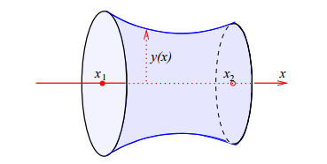
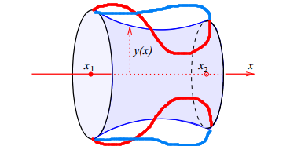

## 1.1 변분법은 어디에 쓰이는가?
**변분법** 이란 함수중 어떤 양을 최대 또는 최소로 만드는 함수를 찾는과정을 의미한다.

보통 미적분에서는 숫자 $x$를 바꿔서 함수값 $f(x)$의 최대/최소를 찾는다.

반면 변분법에서는 숫자가 아니라 함수 $y(x)$를 바꿔가면 어떤 양 $J[y]$를 최대/최소로 만든다.

예를 들면 다음과 같은 문제들이 있다.
1. Dido's problem : 고정된 둘레속에서 넓이가 최대가 되는 함수 찾기
2. Plateau's problem : 경계가 고정됐을 때 면적이 최소가 되는 모양 만들기
3. 최단강하곡선 : 구슬이 마찰없이 곡선을 내려갈때, 가장 짧은시간에 도착하는 곡선 찾기
4. 현수선 : 무거운 줄이나 사슬이 양 끝에 매달려있을 때, 어떤 모양을 이루는지 찾기

위의 문제들의 핵심은 모두 공통적으로 어떤 양을 최대화하거나 최소화하는 함수를 찾는 것이다.

보통 미적분에서는 최대/최소를 찾기 위해 **미분해서 0** 이라는 아이디어를 활용한다.

변분법은 이를 확장하여 $$ \delta J\over \delta y(x) = 0$$을 활용한다.

## 1.2 Functionals, 범함수
범한수(Functional)는 함수를 입력으로 받아 숫자를 출력하는 것이다. 
일반 함수는 보통 
$$f : \mathbb{R}\to\mathbb{R}$$
이다. 즉 숫자를 넣으면 숫자가 나온다. 
반면 범함수는 
$$J: C^\infin(\mathbb{R})\to\mathbb{R}$$
이다. 즉 매끄러운 함수 $y(x)$를 넣으면 숫자 하나가 나온다.

즉 변분법의 목표는 어떤 범함수 $J[y]$를 최대 또는 최소로 만드는 함수 $y(x)$를 찾는 것이다. 이를 위해서는 일반 미분의 확장판인 범함수 미분 **functional derivative**를 정의해야한다.

### 1.2.1 Functional derivative
다음과 같은 범함수를 가정하자
$$J[y] = \int_{x_1}^{x_2}f(x, y, y', y'',...,y^{(n)})dx$$

더 단순하게 1차 도함수에 의존하는 f에 대한 범함수는 다음과 같다.
$$J[y] = \int_{x_1}^{x_2}f(x,y,y')dx$$
여기서 $f$는 x, y(x), 그리고 y의 유한 개 도함수들에 의존한다.
이런 범함수는 **local in $x$** 라고 한다. 각 점 x에서의 값 $y(x), y'(x)$만을 활용하기 때문이다.
좀 더 명확한 정의를 위해 **non-local in $x$** 를 고려하면 
$$J[y] = \int \int y(x)K(x,x')y(x')dxdx'$$
은 non-local이다.($\because x'$)

이제 함수 $y(x)$를 조금 바꿔보자
$$y(x) \to y(x) + \epsilon \eta(x)$$
$\epsilon$은 작은 상수이고, $\eta(x)$는 함수를 어떻게 흔들 것인지 나타내는 임의의 함수이다.
변화된 $y$의 도함수는 다음과 같이 정의된다.
$$y'(x) \to y'(x) + \epsilon \eta '(x)$$

어떤 범함수의 입력 함수 $y(x)$가 $y(x)+\epsilon\eta(x)$만큼 변할 때, 범함수 $J$의 변화량은 다음과 같이 정의된다.
$$J[y + \epsilon\eta] - J[y] = \int_{x_1}^{x_2}[f(x, y + \epsilon\eta,y'+\epsilon\eta') - f(x,y,y')]dx$$
여기서 $[f(x, y + \epsilon\eta,y'+\epsilon\eta')$를 1차 테일러 전개를 하게 되면
$$[f(x, y + \epsilon\eta,y'+\epsilon\eta') = f(x,y,y') + \epsilon\eta{\partial f\over\partial y} + \epsilon \eta' {\partial f \over \partial y' } + O(\epsilon^2)$$

따라서 
$$J[y + \epsilon\eta] - J[y] = \int_{x_1}^{x_2}[\epsilon\eta{\partial f\over\partial y} + \epsilon \eta' {\partial f \over \partial y' } + O(\epsilon^2)]dx$$

위의 적분안에 두번째 항은 다음과 같이 계산된다. (고등학교 부분적분을 떠올리자... 그적미적..)
$$\int_{x_1}^{x_2} \varepsilon \eta' \frac{\partial f}{\partial y'}\,dx=\left[\varepsilon \eta \frac{\partial f}{\partial y'}\right]_{x_1}^{x_2}-\int_{x_1}^{x_2}\varepsilon \eta\frac{d}{dx}\left(\frac{\partial f}{\partial y'}\right)\,dx$$

따라서 전체 변화량은 
$$J[y + \varepsilon\eta] - J[y] = \left[\varepsilon\eta{\partial f \over \partial y'}\right]_{x_1}^{x_2} + \int_{x_1}^{x_2}\varepsilon\eta\left[{\partial f \over \partial y}- {d\over dx}({\partial f \over \partial y'})\right]dx + O(\varepsilon^2)$$

이제 한가지 가정을 더해보자... $y$값이 변하되 끝점이 고정된 변화라고 가정하면
$$\eta(x_1) = 0, \quad \eta(x_2) = 0$$
이 된다. 즉
$$\delta y(x_1)=0, \quad \delta y(x_2)=0$$
이 되므로 경계항 
$$\left[\varepsilon\eta{\partial f \over \partial y'}\right]_{x_1}^{x_2}$$ 이 0이 되어 사라진다.

즉 범함수의 1차 변화량은 다음과 같이 정의된다.
$$\delta J = \int_{x_1}^{x_2}\delta y(x)\left[{\partial f \over \partial y} - \left({d\over dx}\right){\partial f \over \partial y'}\right]$$

범함수의 미분은 다음과도 같이 정의 될 수 있다.
$$\delta J = \int_{x_1}^{x_2}\delta y(x) \left({\delta J \over \delta y(x)}\right)dx$$
$$y(x) = \int dx y(x)'$$와 비슷한 정의라고 보면 될 것 같다.

범함수 미분의 정의 2개의 식을 비교하면 결국 다음과 같은 정의를 얻는다.
$${\delta J \over \delta y(x)} = {\delta f \over \delta y} -  {d\over dx}\left({\partial f \over \partial y'}\right)$$

다변수 함수와 범함수의 미분을 비교해보자
다변수 함수 $M(y_1, y_2, ... ,y_n)$는 변화량이
$$\delta M = \Sigma_i {\delta M \over \delta y_i} \delta y_i$$
로 정의된다.

범함수는 변수 $y_i$가 연속적인 라벨 x를 가진 $y(x)$로 바뀐 형태이다.

## 1.2.2 The Euler-Lagrange equation

범함수의 정지점(stationary point)를 다루기 전에 다변수 함수의 stationary point를 살펴보자
정지점은 최대점, 최소점, 안정점이 될 수 있는 점이다. 점지점에서는 모든 가능한 작은 변화 $\delta y_i $에 대해 
$$\delta M = 0$$
이어야 한다.
$$\delta M = \Sigma_i {\delta M \over \delta y_i} \delta y_i = 0$$
이 되는 필요 충분 조건은 ${\delta M\over \delta y_i} = 0\quad(i = 1,...,n)$이라는 것을 알 수 있다.

이를 확장하면 범함수의 정지점을 같은 논리로 생각할 수 있다. 정지점에서는 모든 가능한 함수 변화 $\delta y(x)$에 대해 
$$\delta J = 0$$
이어야 한다.
그런데 
$$\delta J = \int_{x_1}^{x_2}\delta y(x){\delta J \over \delta y(x)}dx$$
이므로 
$${\delta J \over \delta y(x)} = 0$$
이 위의 조건을 만족한 필요충분 조건이 된다.

이전에 다뤘던 관계식을 이용해 식을 다시 써보면 다음과 같다.
$${\partial f \over \partial y }-{d \over dx}\left({\partial f \over \partial y'}\right) = 0$$
이 식을 **오일러-라그랑주 방정식(Euler-Lagrange equation)** 이라고 한다.
지금까지 살펴본건 이해를 돕기 위해 $x, y(x), y'(x)$에 의존하는 f만 다뤘다. 더 고차에 대해 다룰 경우 **부분적분을 더 많이 해줘야한다.** 반화된 오일러-라그랑주 방정식은 다음과 같다.
$${\delta J \over \delta y(x)} = {\partial f \over \partial y} - {d \over dx}\left({\partial f \over \partial y'}\right) + {d^2\over dx^2}\left({\partial f \over \partial y''}\right) - {d^3 \over dx^3}\left({\partial f \over \partial y^{(3)}}\right) + \cdots$$
이다. 부호가 번갈아 나타난다.

### 1.2.3 Some applications

#### 예제 1. 두 원형 고리 사이의 비누막
두 개의 동축 원형 고리가 있고, 그 사이에 비누막이 형성되어 있다.
비누막은 표면자역 때문에 자유엔지를 최소화하려고 한다.
비누막의 자유에너지는 면적에 비례한다.
비누막은 앞뒤 두 면을 가지므로 자유에너지는
$$2\sigma \times 면적$$
에 해당한다.
축 대칭이므로 비누막은 어떤 곡선 $y(x)$를 $x$-축 주위로 회전시킨 곡면이라고 생각할 수 있다.

곡선 $y(x)$를 $x$축 주위로 회전시킨 면적은
$$J[y] = 2\pi \int_{x_1}^{x_2}y\sqrt{1+y'^2}dx$$
(인터넷에 회전체 옆면의 면적을 구하는 공식을 검색해 보면 위 공식의 증명을 알 수 있다....)

위 식에서 
$$f = y\sqrt{1 + y'^2}$$
라고 보면 된다 그럼 편미분은
$${\partial f \over \partial y} = \sqrt{1 + y'^2}$$
$${\partial f \over \partial y'} = {yy' \over \sqrt{1+y'^2}}$$
이 되고 오일러-라그랑주 방정식은
$$\sqrt{1 + y'^2} - {d\over dx}\left({yy' \over \sqrt{1+y'^2}}\right) = 0$$
이다. 정리하면
$${1\over\sqrt{1 + y'^2}} - {yy''\over (1 + y'^2)^{3\over2}} = 0$$
가 된다.
조금 발상적이긴 하지만... 위의 식에 $y'$을 곱하면
$${y'\over\sqrt{1 + y'^2}} - {yy'y''\over (1 + y'^2)^{3\over2}} = 0$$
$${d\over dx}\left({y\over\sqrt{1 + y'^2}}\right) = 0$$
따라서
$${y\over\sqrt{1 + y'^2}} = \kappa(상수)$$
이걸 풀면 $$y = \kappa cosh({x + a \over \kappa})$$
가 되고 여기서 $a$와 $\kappa$는 경계 조건 
$$y(x_1) = y_1, \quad y(x_2) = y_2$$를 만족하도록 정하면 된다.

    

`앞으로 마술공연을 보면서 형성된 커다란 비누막을 보면 무작정 신기해하지말고 자유에너지를 최소화하기 위해 비누막이 선택한 최적의 곡선을 보았다고 표현해보자`

위의 그림을 좀 만 더 고민해보면 범함수와 **fixed-endpoint** 를 이해하는데 도움이 된다.

    

함수의 최대최소는 x를 변경시켜가며 찾아가는 과정이라면 범함수의 최대/최소는 함수 y(x)를 변경시켜가며 찾아가는 과정이다.(물론 둘 다 도함수가 0이 되는 지점이 유력한 후보다)