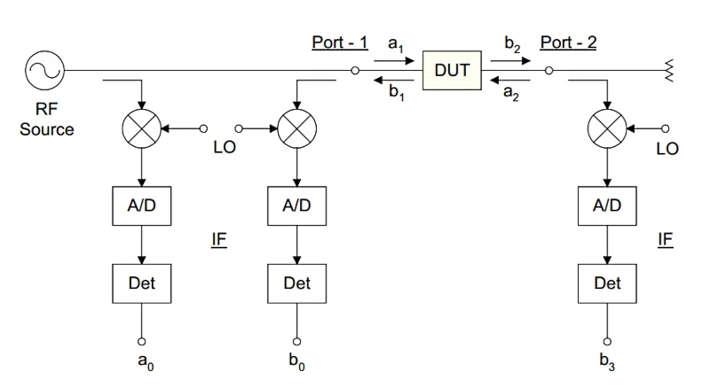
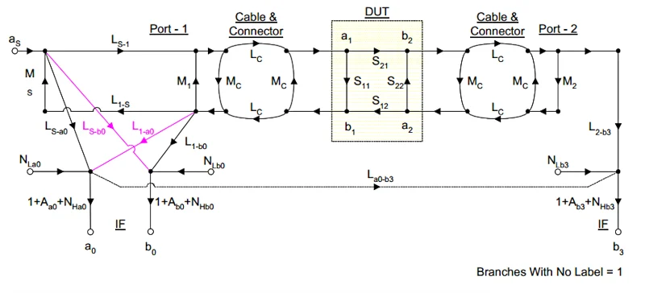
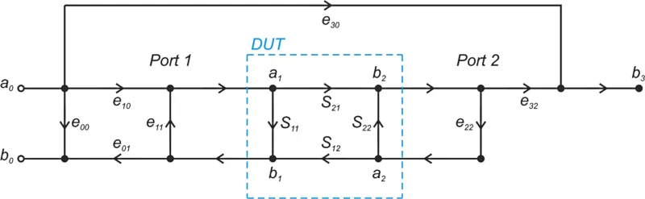
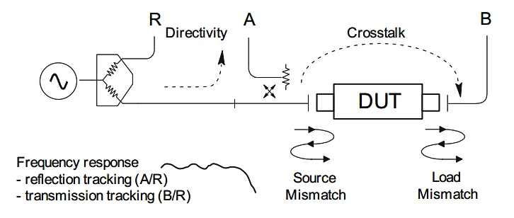
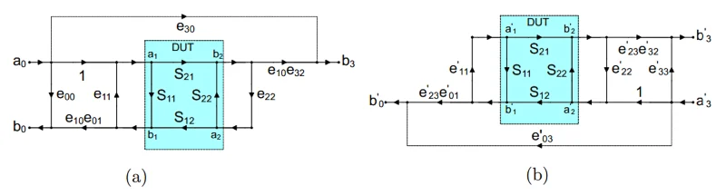
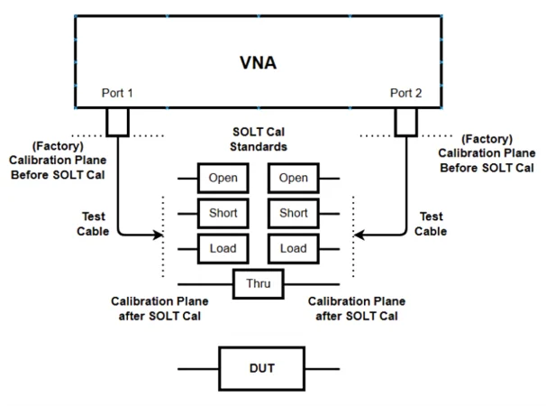

해당 post는 All About Circuits의 
>[https://www.allaboutcircuits.com/technical-articles/understanding-the-12-term-error-model-and-solt-calibration-method-for-vna-measurements/]

를 참고하여 작성하였습니다.

# Calibration - 1
VNA의 좋은 S-parameter 측정을 위해서는 캘리브레이션이 굉장히 중요하다. VNA는 자체로 굉장히 선형적인 receiver를 가지고 있고(선형이 보장되지 않으면 입력된 신호의 크기에 따라 수신기가 왜곡을 일으켜 측정값에 오류가 생기게 됩니다.) 충분한 스펙트럼 순도(신호가 얼마나 깨끗한 단일 주파수 성분으로 구성되어 있는가?)를 가지고 있지만 몇가지 완벽한 측정을 방해하는 요소가 존재하는데 이를 보상하기 위한 과정을 Calibration이라고 한다.

**완벽한 측정을 방해하는 요소들**
1. **Match** : VNA는 매우 넓은 대역을 담당하는 광대역 계측기로써, 기본적인 매칭 성능은 준수한 편이지만 아주 작은 matching 오차라도 시스템상에서 1dB 보다 큰 오차를 발생시킬 수 있음
2. **directivity** : VNA의 핵심 구성요소중 하나는 directional coupler로써 이는 incident wave와 reflected signal을 분리시켜 주는 역할을 수행한다. 해당 장비가 완벽하지 않기 때문에 발생하는 일종의 coupled signal이 존재하게 된다.
3. **Frequency-Response** : VNA 내부의 주파수 응답들은 제조과정에서 보상되어 나오지만 외부에 연결되는 케이블등에 의해 발생하는 주파수 응답은 측정 정확도를 저하시킬 수 있다.
4. **non-linearity** : 완벽하게 선형적이지 않은 특성에 의해 발생하는 외곡
5. **noise** 

요약하자면 캘리브레이션은 이러한 imperfection을 보정해주는 과정이다. 

# Understanding the 12-Term Error Model and SOLT Calibration Method for VNA measurement

## using Singal Flow Graphs to Develop an Error Model

VNA의 블록 다이어그램을 통해 측정 시스템에 대한 오차 모델을 살펴보도록 하자. 피측정 기기(DUT)의 입력 반사 계수($S_{11}$)과 순방향 전송 계수($S_{21}$)를 측정하는 블록 다이어그램은 다음과 같다.

이 시스템의 signal flow graph를 그려보면 다음과 같다.

위의 그래프를 살펴보면 중심에는 S-parameter로 모델링된 피측정 기기(DUT)가 존재합니다. DUT의 입력단과 출력단에는 테스트 셋업의 케이블 및 커넥터를 모델링한 네트워크들이 관찰됩니다. 단순화된 이상적 모델과 달리, 이 그래프는 케이블이 무손실이거나 완벽한 매칭을 이룬다고 가정하지 않습니다. $L_c$와 $M_c$는 각각 상호 연결부의 손실과 매칭을 나타냅니다. 또한, 이 모델은 VNA 내부 방향성 결합기(Directional Coupler)의 제한적인 지향성 효과도 고려합니다.(제한적인 지향성 효과는 그래피의 자주색 경로로 표시) 또한 그래프에는 수신기의 비선형성 및 노이즈 효과를 반영하는 일부 항목들도 포함되어 있습니다. 위 모델에 기반한 교정 방식은 오차 항목들을 결정하기 위해 매우 많은 기지 부하(Known loads)를 측정해야 합니다.(일반적으로 미지수 갯수만큼의 기지 부하 측정이 필요) 따라서 대부분의 VNA는 계통 오차를 최소화하면서 더 간단한 모델을 선택하게 됩니다. 그 중 12-항목 오차 모델(12-term error model)은 단순하면서도 효과적이여서 흔히 사용되는 선택지입니다.

## The 12-term Error Model
12-항목 에러 모델은 2개의 하위 모델들을 포함합니다. 
1. **forward - direction** 측정($S_{11}, S_{21}$ 측정)
2. **reverse - direction** 측정($S_{22}, S_{12}$ 측정)

아래 그림은 forward-direction에 해당되는 하위 모델을 보여줍니다.

forward-direction의 경우 7개의 에러 항목을 포함하는데 이 7개 모두가 독립적이진 않습니다. 예를 들어 우리가 측정된 S-parameter에 대한 equations를 작성해보면 $e_{10}, e_{01}, e_{32}$의 항목들이 단독으로 나타나는 곳이 없다는 것을 알 수 있습니다. 대신에 $e_{01}, e_{32}$는 각각 $e_{01}$과 결합하여 복합적인 항목을 형성합니다. 결과적으로 이 모델에서 구해야하는 미지수 개수는 7개에서 6개로 줄어듭니다.
쉽게 설명하자면 $e_{01}, e_{32}$는 단독으로 측정할 수 없고 항상 $e_{01}$와 함께 나오기 때문에 각각을 따로 측정할 필요 없이 $e_{01} \& e_{01}$, $e_{32} \& e_{01}$를 측정하면 됩니다.

reverse-dirction의 경우 따로 그림을 뺄 필요 없이 위의 forward-direction과 대칭을 이룬다고 보면 됩니다. 여기에서도 서로 다른 값을 가지는 6개의 오차 항목 ($e'_{33}, e'_{30}, e'_{22}, e'_{11}, e'_{23}e'_{32}, e'_{23}e'_{01}$)이 포함되어, 모델 전체적으로 12개의 오차 항목을 가지게 됩니다.

S-parameter 측정에서 12-항목 오차 모델이 선호되는 이유 중 하나는 각 오차 항목을 물리적 이해 가능한 오차 원인들과 연관 지을 수 있기 때문입니다. 오차는 세 가지 범주로 나눌 수 있으며, 각 범주는 각 서브 모델당 두 개씩의 오차 항목을 포함합니다:

1. 신호 누설 (Signal leakage)
    - 지향성 오차 (Directivity error): $e_{00}$ 및 $e'_{33}$ 
    - 격리 오차 (Isolation error): 크로스토크(Crosstalk)라고도 함 ($e_{30}$ 및 $e'_{30}$) 
2. 신호 반사 (Signal reflection)
    - 소스 매치 오차 (Source match error): $e_{11}$ 및 $e'_{22}$ 
    - 로드 매치 오차 (Load match error): $e_{22}$ 및 $e'_{11}$ 
3. 주파수 응답/추적 (Frequency response/tracking)
    - 반사 추적 오차 (Reflection tracking error): $e_{10}e_{01}$ 및 $e'_{23}e'_{32}$ 
    - 전송 추적 오차 (Transmission tracking error): $e_{10}e_{32}$ 및 $e'_{23}e'_{01}$

아래 그림은 오차들의 물리적인 의미를 요약해준 그림입니다.

먼저 VNA의 **누설 오차(Signal leakage)**는 지향성 오차나 크로스토크의 형태로 나타날 수 있습니다. 지향성 오차는 이름에서도 알 수 있듯이 VNA의 유한한 지향성과 관련이 있지만, 오직 coupler의 지향성에만 의존하진 않습니다. 이를 유발하는 모든 파라미터는 이 포스트에서 다루지 않지만 더 자세히 알고 싶으면 `"Handbook of Microwave Component Measurements"`를 추천합니다. 격리 오차는 크로스토크라고도 하며 테스트 포트간의 유한한 격리 특성을 모델링 합니다. 즉, 피측정 기기(DUT)를 완전히 거치지 않고 우회하는 모든 신호를 말합니다. 이러한 누설 오차는 VNA 본체 내부에서 발생할 수 있지만, 현대적인 VNA에서는 매우 드문 일입니다. 코로스토크는 보통 두 DUT 연결부 사이의 전자기적 결합 형태로 나타납니다. 예를 들어 프로브 스테이션 측정 시스템의 프로브들 사이에서 발생합니다. **주의할 점은 크로스토크 보정은 위치 변화에 매우 민감할 수 있다는 점이다.(캘리브레이션 이후에 케이블이나 프로브들을 고정시켜야 더 정확한 측정이 가능함을 의미한다.)** 하지만 현대의 VNA에서는 포트 간 격리 성능이 보통 시스템의 노이즈 플로어보다 크기 때문에, 크로스토크를 적절히 특성화하기 어렵습니다. 이러한 이유로 보통 크로스토크는 0으로 설정됩니다.(미지수 개수가 12개에서 10개로 줄어듦)

**신호 반사 오차(signal reflection)**는 VNA 포트의 불완전한 임피던스 매칭과 관련이 있습니다. 소스 매치(Source match) 오차는 신호를 공급하는 포트의 임피던스 미스매치를 설명하며, 로드 매치(Load match) 오차는 DUT의 출력단에 연결된 VNA 포트의 미스메치를 반영합니다. 각 포트에 대해 서로 다른 오차 항목을 사용하는 이유는, 해당 테스트 포트가 자극 신호를 공급하고 있느냐 아니냐에 따라 포트 매칭 상태가 달라지기 때문입니다. 

**추적 오차(Tracking Errors)**는 주파수 응답 오차라고도 불리며 전송과 반사 측정 모두에 영향을 미칩니다. 이 오차 항목들은 주어진 측정 경로에서의 상대적인 손실을 나타낼 뿐만 아니라, 측정에 관련된 수신기들 사이의 주파수 응답 차이를 반영합니다. 반사 추적 오차는 다음과 같은 과정을 거칠 때 발생하는 주파수 응답 오차를 설명합니다.
>VNA 포트를 나감 $\rightarrow$ 케이블과 커넥터를 통과함 $\rightarrow$ DUT의 입력단에서 반사됨
$\rightarrow$ 케이블을 다시 통과하여 VNA로 돌아옴 $\rightarrow$ 최종적으로 VNA의 측정용 수신기에서 감지됨

마찬가지로 전송 추적 오차는 입사 신호가 소스 테스트 포트에서 로드 테스트 포트로 이동하면서 겪는 상대적인 손실과 위상 변화를 고려합니다.

반사 추적과 전송 추적 오차는 모두 복합적인 오차 항목으로 표현됩니다. 이를 이해하기 위해 S-파라미터 측정은 비율이라는 점에 주목해야 합니다. $\rightarrow S_{11} = \frac{b_0}{a_0}$ 
따라서 두 경로의 주파수 응답이 완벽하게 동일하지 않으면 측정된 반사 계수에 오차가 발생하게 됩니다.

## 12-Term Error Correction

위의 그림은 보정해야할 순방향의 6개 항목 역방향의 6개 항목을 보여준다. 이 12개의 항목을 보정하기 위해서는 우리는 12개의 항목의 값들을 찾아낼 필요가있다. 가장 일반적인 방법은 SOLT 방법이며 12개의 항목을 측정하기 위해 Short, Open, Load, Through를 기준으로 사용한다. 

 

이제 12개의 보정해 주어야할 항목들에 대한 정의를 마쳤으니 다음 게시물에서 SOLT 알고리즘으로 이를 보상하는 방법에 대해 알아보자.
