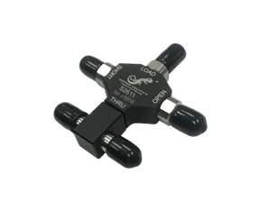
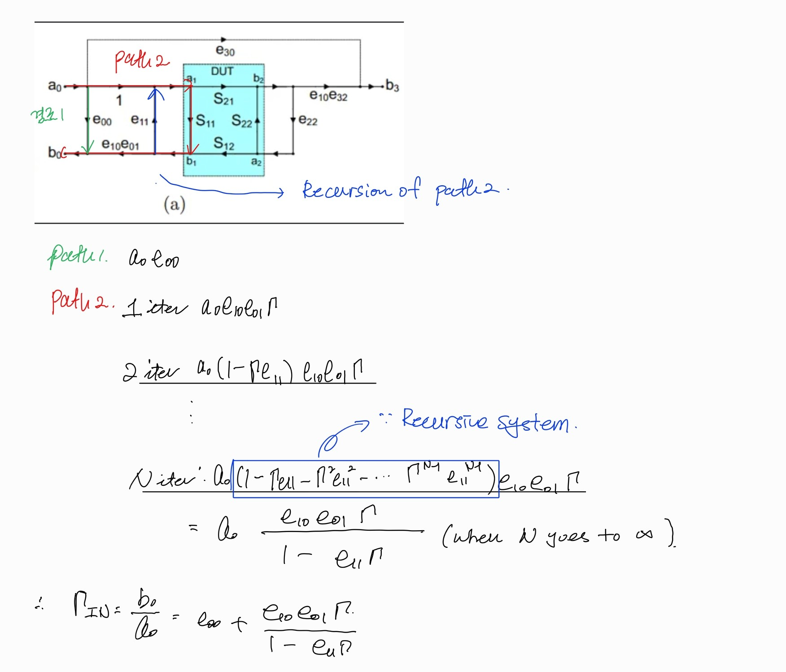

해당 post는 All About Circuits의 
>[https://www.allaboutcircuits.com/technical-articles/understanding-the-solt-calibration-method-and-the-behavior-of-open-and-short-standards-on-the-smith-chart/]

를 참고하여 작성하였습니다.

해당 포스트는 이전 포스트와 이어집니다. [이전 포스트](../calibration_1/)를 먼저 읽으시는 것을 추천합니다.

## Understanding RF Calibration Using Short, Open, Load, and Through Terminations

이전 포스트에서 우리는 12개의 에러 항목들을 측정하는 것이 calibration의 핵심임을 확인했다. 이를 위해 사용되는 SOLT 알고리즘에 대해서 살펴보자

## The SOLT Calibration
SOLT 캘리브레이션은 Short, Open, Load and Through Standards를 활용하여 에러 항목들을 측정하는 시스템이다. 일반적으로 calkit 안에는 위의 네가지 기준들이 포함되어 있다.

다시 12개의 항목의 에러들을 살펴보도록 하자. 이 forward 서브 모델의 에러텀들(a)을 찾기 위해서는 우리는 3가지 단계를 따라야한다.
1. 1-포트 교정 적용
2. isolation 특성 결정
3. Through 측정

여기서는 순방향 측정에 대한 과정만 살펴볼 것이지만, 동일한 3단계 절차를 역방향 서브 모델의 오차항목을 찾는데에도 적용할 수 있습니다. 우리가 해야할 일은 방정식에 대입할 오차 항목의 종류를 바꾸는 것 뿐입니다.

### Step1 : Apply One-Port Calibration
이 과정에서는 순방향 모델의 입력 반사 계수가 3개의 기준(Short, Open, Load)에 의해서 정해진다.
$$\Gamma_{IN} = e_{00} + \frac{e_{10}e_{01}\Gamma_L}{1 - e_{11}\Gamma_L}$$
위의 공식이 어떻게 나오는지 잘 이해가 안가시는 분들은 아래 필기를 참고해주기 바란다.

이 때 3개의 서로 다른 기준($\Gamma_L$)에 따른 값을 측정함으로써 세 개의 독립 방정식을 얻게 되며, 각 방정식은 세 개의 미지수 오차 항목($e_{00}$, $e_{10}e_{01}$, $e_{11}$)를 포함하게 됩니다. 이상적인 환경에서 Short, Open, Load 기준물은 각각 -1,1,0의 $\Gamma_L$값을 가져야 합니다. 물론 현실은 이상적이지 않기 때문에 실제 Short와 Open의 반사 계수가 어떤 모습인지는 곧 다루게 될 것입니다.

### Step2 & 3 : Determining Isoloation and the Through Measurement

누설 항목($e_{30}$)을 찾기 위해서 우리는 matched loads를 포트1과 포트2에 연결하고 S21을 측정해야한다. 이건 선택적으로 수행할 수 있는데 현대적인 VNA에서는 이 값이 사실상 0으로 처리되기 때문이다.

마지막으로, 우리는 쓰루(Through) 기준물을 사용하여 VNA의 포트 1과 2를 서로 연결합니다. $S_{11}$과 $S_{21}$ 파라미터를 측정함으로써, 우리는 남은 두 가지 오차 항목($e_{22}$ 및 $e_{10}e_{32}$)을 결정하기 위한 두 개의 독립적인 방정식을 얻게 됩니다
$$S_{21M} = \frac{e_{10}e_{32}}{1 - e_{11}e_{22}}$$

$$S_{11M} = e_{00} + \frac{e_{10}e_{01}e_{22}}{1 - e_{11}e_{22}}$$
위의 값들을 구하는건 위의 필기를 참고해서 스스로 구해보도록 하자...!

이제 우리는 6개의 모든 항목들을 찾아냈다. 역방향의 경우에도 동일하게 수행해주면 된다. 참고로 만약 S11만 사용할 경우 Through에 대한 과정은 생략할 수 있음을 알 수 있다.

## Ideal Standard vs Real
### 1. open standard
open은 중심 도체의 한쪽 끝이 연결되지 않은 상태이지만, 실제로는 커넥터 입구와 실제 개방 지점 사이에 미세한 길이의 전송선로가 존재합니다. 이를 정확히는 'Offset Open'이라고 부릅니다. 개방된 끝단에서 내부 도체와 외부 도체 사이에 Fringing Capacitance($C_e$)가 형성되는데 이 값은 주파수가 높아질 수록 변하기 때문에, VNA는 이를 3차 다항식으로 계산합니다.
$$C_e(f) = C_0 + C_1f + C_2f^2 + C_3f^3$$
- smith chart 특성 : 이상적인 Open은 차트 오른쪽 끝의 점(Phase $0\degree$)에 찍혀야 하지만 실제로는 오프셋 길이와 정전 용량 때문에 주파수가 높아질 수록 시계방향으로 호를 그리며 이동합니다.

### 2. short standard
short는 중심 도체와 외부 도체가 물리적으로 연결된 상태입니다. Open과 마찬가지로 오프셋 길이가 존재하여 'Offset Short'가 됩니다. 단락 지점에는 기생 인덕턴스(Inductance, $L_e$)가 발생하며, 고주파(특시 3.5mm 이하 커넥터)에서는 이를 3차 다항식으로 모델링 해야 정확합니다.
$$L_e(f) = L_0 + L_1f + L_2f^2 + L_3f^3$$
- 스미스 차트 특성 : 이상적인 Short는 왼쪽 끝의 점(Phase $180\degree$)에 찍혀야 하지만 실제로는 오프셋 길이와 기생 인덕턴스 때문에 **시계 방향으로 호**를 그리며 이동합니다.

## 정밀 모델 구하기

- Open (개방)커패시턴스: $C_e(f) = C_0 + C_1f + C_2f^2 + C_3f^3$ 
    - 임피던스: $Z_{Open}(f) = \frac{1}{j 2\pi f C_e(f)}$ (이후 오프셋 지연 반영) 
    - 반사 계수: $\Gamma_{Open}(f) = \frac{Z_{Open}(f) - Z_0}{Z_{Open}(f) + Z_0}$
    $\quad$
- Short (단락)인덕턴스: $L_e(f) = L_0 + L_1f + L_2f^2 + L_3f^3$  
    - 임피던스: $Z_{Short}(f) = j 2\pi f L_e(f)$ (이후 오프셋 지연 반영) 
    - 반사 계수: $\Gamma_{Short}(f) = \frac{Z_{Short}(f) - Z_0}{Z_{Short}(f) + Z_0}$ 
    $\quad$
- Load (부하)
    - 임피던스: $Z_{Load}(f)$ = $R + j(2\pi f L_{series} - \frac{1}{2\pi f C_{shunt}})$ (이상적인 경우 $Z_0$(50Ω)에 가깝습니다.)
    - 반사 계수: $\Gamma_{Load}(f) = \frac{Z_{Load}(f) - Z_0}{Z_{Load}(f) + Z_0}$
    $\quad$

$$\begin{cases} 
\Gamma_{IN, Open} = e_{00} + \dfrac{e_{10}e_{01}\mathbf{\Gamma_{Open}(f)}}{1 - e_{11}\mathbf{\Gamma_{Open}(f)}} \\[15pt]
\Gamma_{IN, Short} = e_{00} + \dfrac{e_{10}e_{01}\mathbf{\Gamma_{Short}(f)}}{1 - e_{11}\mathbf{\Gamma_{Short}(f)}} \\[15pt]
\Gamma_{IN, Load} = e_{00} + \dfrac{e_{10}e_{01}\mathbf{\Gamma_{Load}(f)}}{1 - e_{11}\mathbf{\Gamma_{Load}(f)}} 
\end{cases}$$

또한 실제로 Open, Short를 바로 연결했다면 지연이나 감쇄가 발생하지 않지만 실제로는 ohminc loss나 delay가 발생하게 된다. 이를 고려한 $\Gamma$는 다음과 같다.
$$\text{Phase\_Rot} = e^{-j \cdot 2\pi f \cdot \text{offset\_delay\_s}}$$ 

$$\text{Mag\_Loss} = e^{-\text{offset\_loss} \cdot \sqrt{f/f_0}}$$ 

$$\mathbf{\Gamma_{L}(f)} = \Gamma_{term} \cdot \text{Mag\_Loss} \cdot \text{Phase\_Rot}$$ 
