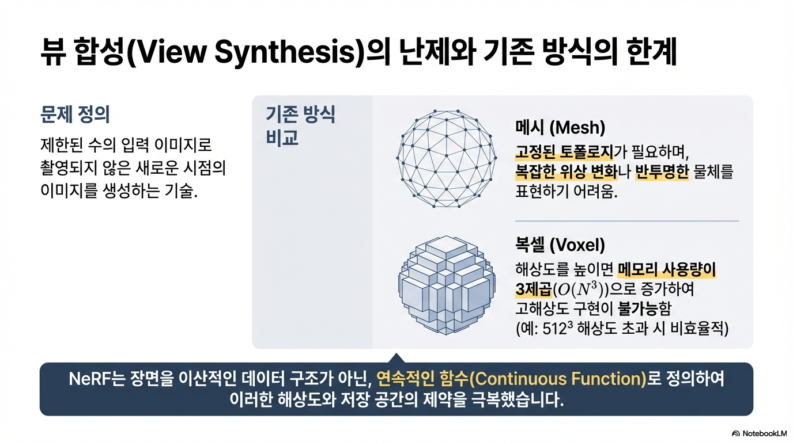
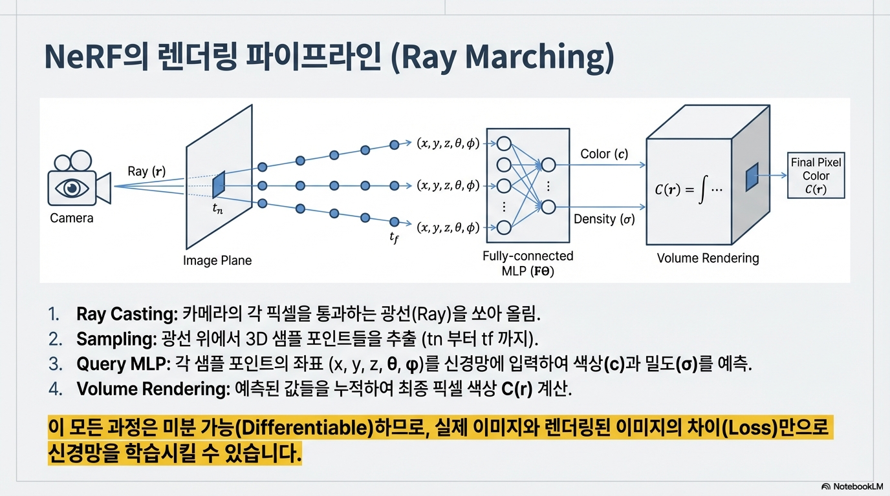

# NeRF : Representing Scenes as Neural Radiance Fields for View Synthetic

## Executive Summary
- NeRF는 장면을 연속적인 5D 함수로 표현한다: 입력은 **3D 위치 x**와 **시선 방향 d**, 출력은 **볼륨 밀도 σ**와 **색 c**이다.
- 픽셀은 카메라에서 쏜 광선을 따라 여러 점을 샘플링 하고 각 점에서 $(\sigma, c)$를 얻어 **볼륨 렌더링(확률적 누적)** 으로 색을 합성한다.
- $\sigma$는 그 지점에서 광선이 종료(충돌)할 확률의 미분형으로 해석되고, 투과율은 $T$는 지금까지 아무것도 안 맞고 살아남았을 확률로 해석된다.
- 연속 적분은 이산 샘플 합으로 근사되며, 이 형태는 **미분 가능**해서 픽셀 MSE 손실이 네트워크 파라미터 $\Theta$로 역전파 된다.
- 효율을 위해 coarse 결과로 만든 가중치 $\omega_i$를 PDF(확률 밀도 함수)로 써서, 중요한 구간에 fine 샘플을 더 배치하는 **hierarchical smapling**을 활용한다.

## 1. Background & Problem Setting
### 1.1 Novel View Synthesis 문제
- 입력 : 한 장면을 여러 각도에서 찍은 이미지들 + 각 이미지의 카메라 파라미터(포즈 포함)
- 목표 : 훈련 때 없었던 새로운 카메라 위치/자세에서의 이미지를 그럴듯하게 생성(렌더링)

여기서 핵심 포인트는 "장면을 무엇으로 저장할거냐" 인데 NeRF는 그 **저장방식을 격자(voxel)나 메시(mesh)가 아니라 함수로 택함**

### 1.2 NERF의 관점
- 장면을 "3D 모델 파일"로 저장하는 대신 위치/방향에 따라 보이는 빛은 무엇인가를 답하는 **연속 함수**로 저장

    $\rightarrow$ 이 관점 때문에, 한 번 학습되면 어떤 카메라에서도 광선만 쏘면 이미지를 뽑을 수 있다.(=view synthesis)
## 2. Sceneepresenatation as a Neural Field
### 2.1 5D 입력과 출력의 정의 (NeRF의 함수)
Nerf는 MLP로 다음 함수를 근사한다:
- 입력 : $(x,d)$
    - $x = (x,y,z)$: 공간 위치(3D)
    - $d$ :시선 방향 (보통 $\theta, \phi$ 또는 단위 벡터로 표현)

- 출력 : ($\sigma$, c)
    - $\sigma(x)$ : 볼륨 밀도
    - $ c(x,d)$ : 그 방향에서 보이는 RGB 색

### 2.2 왜 $\sigma$는 방향을 안보고, c는 방향을 보나?
- $\sigma$는 공간에 물체가 존재하냐(기하/점유)에 가까움 $\rightarrow$ 방향에 따라 달라지면 3D가 흔들림
- 색 c는 재질/반사 때문에 시선 방향에 따라 달라질 수 있음(view-dependent)
즉, 기하(geometry)와 외관(appearance)을 분리하는 최소한의 귀납 편향을 네터워크에 넣음

### 2.3 Ray의 표기
다음 장의 이해를 위해 표기만 미리 언급하고 가자
$$r(t) = \vec o + t\vec d$$
- $o$ : 광선 시작점
- d : 픽셀 방향의 단위 벡터
- t : 광선을 따라가는 거리 파라미터

## 3. Volume Rendering Formulation
### 3.1 Ray(광선)와 Radiance Field의 역할
가상 카메라에서 한 픽셀을 찍는다는 건, 그 픽셀 방향으로 **광선(Ray)** 하나를 정면에 쏘는 것과 같다고 놓음.
$$r(t) = o + td,\  t \in [t_n, t_f]$$
- o : 카메라 중심(광선 시작점)
- d : 해당 픽셀 방향의 단위벡터
- [$t_n, t_f$] : near/far 구간(샘플링/적분 범위)

Nerf의 장면 표현은 이 광선 위 임의의 점 r(t)에서 
- $\sigma(r(t))$: 밀도(얼마나 "걸리기 쉬운가")
- $c(r(t), d)$ : 그 방향으로 보이는 색
으로 표현 (2장에서 정의한 5D $\rightarrow$ ($\sigma, c$)와 연결)

### 3.2 픽셀 C(r)은 왜 적분인가?
논문은 "연속 radiance field에서 한 ray의 색 C(r)은 고전적 volume rendering 원리로 렌더링한다"고, 실제로 각 픽셀 ray에 대해 이 C(r) 적분을 계산해야 한다고 함.

**직관적인 설명**
- 광선을 따라가면, 어떤 구간은 빈 공간이고 어떤 구간은 물체(또는 안개/재질)이 있다.
- 각 위치는 "거기서 빛이 발생/반사되어 나오는 색 c"를 가진다.
- 하지만 그 빛이 카메라까지 오려면 그 앞 구간들을 뚫고 살아남아야한다.
따라서 픽셀 색은
$$C(r)=\int_{t_n}^{t_f} T(t)\,\sigma(r(t))\,c(r(t),d)\,dt$$
여기서 핵심은 T(t)가 단순한 가중치가 아니라, **그 지점까지 빛이 살아남아 도달할 확률(투과율)** 이라는 점이다.

### 3.3 T(t)는 왜 지수형태인가?(생존확률 = 누적 감쇠)
연속 볼륨에서는 "아주 작은 구간 dt" 동안 충돌할 확률이 $\sigma(t)dt$라고 볼수 있다.
그러면 통과확률은 $1-\sigma(t)dt$가 되고 "생존확률 업데이트"는 아래 수식과 같아진다.
$$T(t+dt)=T(t)(1-\sigma(t)\,dt)$$
(기존의 생존 확률에 충돌 확률을 곱하는 식으로 업데이트 한다고 보면됨.)

해당 식을 미분 방정식으로 바꾸면:
$$\frac{dT}{dt}=-\sigma(t)T(t)$$

해는 지수 누적 형태로 고정됨:
$$T(t)=\exp\left(-\int_{t_n}^{t}\sigma(r(s))\,ds\right)$$
직관적으로 앞에서 잘 안보이던 녀석들은 뒤로 갈수록 가시성이 지수적으로 떨어진다는 말일듯...
(EM wave의 문제를 풀려면 지수가 감쇄를 해결해야 할수도...?)

## 4. Discretization & Differentiable Rendering

### 4.1 왜 이산화가 필요한가?
3장의 적분 렌더링은 이론적으로 깔끔하지만, 실제 구현은 샘플링 기반의 수치적 근사로 구현.
즉 $[t_n, t_f]$를 N개 구간으로 쪼개고 각 구간에서 한 점씩 "대표 샘플"을 뽑아서 적분을 합으로 바꾼다.

### 4.2 Stratified sampling(구간 내 랜덤 샘플링)
광선 구간을 균일 분할해서 bin을 만들고, 각 bin에서 하나의 샘플을 랜덤으로 뽑음.
$\rightarrow$ 고정 샘플링보다 연속 함수 학습에 유리

### 4.3 구간에서 "걸릴 확률" $\alpha_i$
i 번째 구간 길이를 $\delta_i = t_{i+1} - t_i$라고 하고, 구간 내 밀도를 상수 $\sigma_i$로 근사하면
그 구간을 통과할 확률이 $exp(-\sigma_i\delta_i)$가 된다. (3.3 장의 마지막 수식을 참고하자... 미소 범위라 상수 취급을 해 적분이 단순 곱셈으로 생각하면 될 것 같다.)

따라서 구간에서 한 번이라도 걸릴 확률(불투명도)은:
$$\alpha_i = 1-\exp(-\sigma_i\delta_i)$$
즉 $\alpha_i$ 가 높을수록 불투명하고 낮을수록 투명함을 의미한다.

### 4.4 구간 시작까지의 생존확률 $T_i$
i 번째 구간에서 뭔가 "보이려면", 그 지점까지 광선이 이전 구간들에서 안 죽고 살아남아야 한다.

연속에서 $T(t) = exp(-\int\sigma)$였으니, 이산에서는 적분이 합으로 바뀐다.:
$$T_i=\exp\left(-\sum_{j=1}^{i-1}\sigma_j\delta_j\right)$$

### 4.5 최종 이산 렌더링 식 (알파 컴포지팅 형태)
픽셀 색은 각 샘플의 색이 가중합으로 섞이는 형태가 된다.
$$\hat C(r)=\sum_{i=1}^{N} T_i\,\alpha_i\,c_i$$
$$ \therefore \hat C(r)=\sum_{i=1}^{N} T_i\left(1-e^{-\sigma_i\delta_i}\right)c_i$$

여기서 $T_i\alpha_i$는 각 색깔들이 섞이는 가중치라고 볼수 있으니 다음과 같이 수정이 가능하다.
$$w_i := T_i\alpha_i
\quad\Rightarrow\quad
\hat C(r)=\sum_{i=1}^{N} w_i c_i$$

위의 수식을 보면 드디어 인공지능에서 볼 법한 수식들이 나옴을 알 수 있다.
$w_i$는 단순히 광선의 생존/사망 확률을 나타내기 보다 최종 픽셀의 영향도를 평가하는 가중치라고 볼수 있다.
- 빈 공간 : $\alpha_i = (1-e^{-\sigma_i\delta_i}) \rightarrow 0(\because \sigma_i \approx 0)$
- 가려진 뒤쪽 : 광선의 생존 확률이 낮아지기 때문에 $T_i$가 작아짐 $\rightarrow w_i 작음$
- 보이는 표면 근처 : $T_i$도 살아있고, $\sigma_i$도 커서 $\alpha_i$가 큼 $\rightarrow w_i 큼$  

### 4.6 왜 미분 가능인가?
위 이산 렌더링은 결국
- 덧셈/곱셈
- 지수함수 exp
- 네트워크 출력 $\sigma_i, c_i$
만으로 구성됨
즉 $\hat C$는 $\sigma_i, c_i$에 대해 미분 가능이고, $\sigma_i, c_i$는 네트워크 $F_\Theta$의 출력이므로 손실의 그레디언트가 $\theta$로 역전파된다.

## 5. Hierarchical Sampling(Coarse-to-Fine)
### 6.1 왜 계층적 샘플링이 필요한가?
균일하게 N개 샘플을 많이 찍으면 품질은 좋지만, 대부분 빈공간이거나 이미 가려진 구간이라서 계산 낭비가 커짐

따라서 Nerf는
1. 대충(Coarse) 찍어서 어디가 중요한지 찾고
2. 중요한 곳에 더 촘촘히(fine) 찍음
의 전략을 활용한다.

### 5.2 Coarse 패스 : 적은 샘플로 $w_i$ 추정
먼저 Coarse 네트워크로 $N_c$개 샘플을 찍고 4장의 이산 렌더링으로 $\hat C$를 만든다.
(렌더링 식 자체는 4장과 동일)

$$\hat C_c(r)=\sum_{i=1}^{N_c} w_i^{(c)}\,c_i^{(c)}
\quad,\quad
w_i^{(c)}=T_i^{(c)}\left(1-e^{-\sigma_i^{(c)}\delta_i}\right)$$
여기서 얻는 $w_i^{(c)}$rk "구간별 첫 충돌 확률 질량"이 된다.

### 5.3 $w_i$로 PDF 만들기 : "중요한 구간에 샘플 몰기"
coarse의 가중치들을 정규화해서 "샘플링 분포(PDF)"로 만든다.

$$\tilde w_i=\frac{w_i^{(c)}}{\sum_k w_k^{(c)}}$$
그리고 $[t_n, t_f]$ 구간에서, 각 bin에 해당하는 piecewise-constant PDF로 보고 그 분포에서 $N_f$개 샘플을 추가로 뽑는다.(보통 inverse transform sampling/CDF sampling)

직관적인 설명을 보태자면
- $w_i$가 클수록 픽셀에 진짜 영향을 줄 가능성이 큰 구간
- 그 구간에서 샘플을 뽑아야 같은 계산량에서 품질이 올라감

### 5.4 Fine 패스 : 합쳐서 더 정확한 $\hat C_f$ 계산
fine 단계에서는 coarse 샘플 $N_c$와 새로 뽑은 $N_f$를 합쳐서 총 $N_c + N_f$샘플로 다시 렌더링한다.

$$\hat C_f(r)=\sum_{i=1}^{N_c+N_f} w_i^{(f)}\,c_i^{(f)}
\quad,\quad
w_i^{(f)}=T_i^{(f)}\left(1-e^{-\sigma_i^{(f)}\delta_i}\right)$$

이때 $w^{(f)}_i$는 합쳐진 샘플 시퀀스의 순서에 따라 다시 계산된다.(투과율이 앞 샘플에 의해 결정되기 때문)

### 5.5 학습과의 연결
- coarse는 "샘플링 분포(PDF)"를 만들기 위해서도 잘 맞아야 함
-  fine은 최종 품질을 위해서 잘 맞아야 함
그래서 손실을 coarse + fine 둘 다에 걸어줌

직관적으로 말하면 coarse는 어디가 표면/내용인지 대충 찾고 이후에 fine을 통해 주변을 정밀하게 그린다.

## 7. Training
### 7.1 Learning Objective : 픽셀 오차(MSE)로 NeRF를 학습한다.
NeRF 학습은 결국 "진짜 사진의 픽셀"과 "NeRF가 렌더링한 픽셀 색"를 줄이는 문제임
한 iteration에서 픽셀에 해당하는 ray 집합 R를 뽑고, 각 ray의 렌더링 결과가 정답 픽셀 색 $C(r)$와 같아지도록 학습한다.

NeRF는 coarse/fine 둘 다 렌더링 결과를 만들기 때문에, 손실도 두 결과에 동시에 준다.
$$\mathcal{L}=
\sum_{r\in R}
\left(
\|\hat C_c(r)-C(r)\|_2^2
+
\|\hat C_f(r)-C(r)\|_2^2
\right)
$$

coarse와 fine을 둘 다 업데이트하면서 "중요한 부분을 대충 찾은 후 고도화 작업(Coarse-to_fine)"의 개념을 만족할 수 있게 된다.

### 7.2 최종적으로 업데이트 되는것은?
업데이트 되는 것은 결국 네트워크 파라미터 $\Theta$
- Coarse 네트워크 파라미터 : $\Theta_c$
- fine 네터워크 파라미터 : $\Theta_f$

업데이트는 Adam을 활용
$$\Theta_c \leftarrow \Theta_c - \eta \nabla_{\Theta_c}\mathcal{L}
\qquad
\Theta_f \leftarrow \Theta_f - \eta \nabla_{\Theta_f}\mathcal{L}
$$

### 7.3 Gradient Flow
렌더링은 결국 "샘플들의 색을 가중합"으로 섞는 구조
$$\hat C(r)=\sum_{i} w_i c_i
\qquad
w_i=T_i\left(1-e^{-\sigma_i\delta_i}\right)
$$

여기서 학습이 의미하는 교정은 크게 두가지

**(1) 색 $c_i$ 업데이트 방향**
샘플 색은 "내가 픽셀에 기여한 정도 $w_i$"만큼 강하게 교정됨
$$\frac{\partial \hat C}{\partial c_i} = w_i
\quad\Rightarrow\quad
\frac{\partial \mathcal{L}}{\partial c_i}\propto w_i
$$

즉, 픽셀에 거의 안보이는 샘플은 색을 고치지 않고, 진짜로 보이는 샘플만 색으로 고친다.
($w_i$의 의미를 다시한변 잘 세겨보길 바란다.)

**(2) 밀도 $\sigma_i$의 업데이트 방향**

밀도는 단순히 "내 지점이 더 보이게 하자"만이 아니라, 동시에 "뒤를 가린다"는 효과를 가진다.
이 부분은 이미 많이 언급해서 충분히 이해가 됐을거라고 생각한다.

$$\frac{\partial \hat C}{\partial \sigma_i}
=
\underbrace{\delta_i T_i(1-\alpha_i)c_i}_{\text{내 지점 기여 증가}}
-
\underbrace{\delta_i\sum_{j>i} w_j c_j}_{\text{뒤쪽 기여 감소}}
$$

### 8. Positional Encoding as Fourier Features
Positional Encoding은 아마 "attention is all you need"라는 유명한 논문때문에 그다지 생소하지 않은 개념이지만 둘이 쓰이는 방식이 다르다.

### 9.1 문제 : 좌표를 그대로 넣으면 디테일이 뭉개진다.

NeRF는 입력이 "연속 좌표" 즉 픽셀을 만들때마다 $(x, y, z, \theta, \phi)$ 같은 실수 좌표를 MLP에 넣는다.
그런데 좌표를 그대로 넣으면, 얇은 구조물/경계/텍스처 같은 고주파 디테일이 잘 재현되지 않는다.

실제로 딥넷은 저주파를 더 먼저 더 잘 학습하려는 경향이 있다고 하며 고주파로 갈수록 성능이 떨어진다고 한다. 이를 해소하기 위해 도입된 개념이 positional encoding이다.

핵심은 고주파 성분을 입력 feature로 제공하는 것이다.

### 9.2 핵심 구조 : $F_\Theta = F'_\Theta\cdot \gamma$
NeRF는 원래 네트워크 $F_\Theta$를 그대로 쓰지 않고, 입력에 고정된 변환 $\gamma$를 먼저 적용한 뒤 MLP에 넣는 구조로 바꾼다.
$$F_\Theta = F'_\Theta \circ \gamma$$
이 구조의 핵심은 고주파 표현을 네트워크가 해결하게 두지 않고, 입력 표현에서 해결하는 구조로 바꾸는 것이다.

### 8.3  $\ \gamma$의 정의 : 다중 주파수 sin/cos(Fourier feature map)
positional encoding $\gamma$는 좌표 p를 여러 주파수의 사인/코사인 값으로 바꿔서 고차원 벡터로 만드는 것이다.
$$\gamma(p)=\big(
\sin(2^{0}\pi p),\cos(2^{0}\pi p),\;
\sin(2^{1}\pi p),\cos(2^{1}\pi p),\;
\dots,\;
\sin(2^{L-1}\pi p),\cos(2^{L-1}\pi p)
\big)
$$

위의 표현은 푸리에를 아는 사람에게는 익숙한 표현이다. 핵심은 좌표를 Fourier basis위로 펼치는 것이다.

PE가 없는 경우:
고주파 함수는 네트워크가 '내부에서 생성'해야 하는데 고주파의 경우 ReLU의 조합으로 스스로 만들기 힘들다.
(UAT(Universal approxiation Theorem)과 연관지어 생각해보면 좋겠다.)

PE를 사용하는 경우:
이미 벡터안에 고주파 항들이 있기 때문에 생성할 필요 없이 단순히 계수만 맞춰주면 된다.

