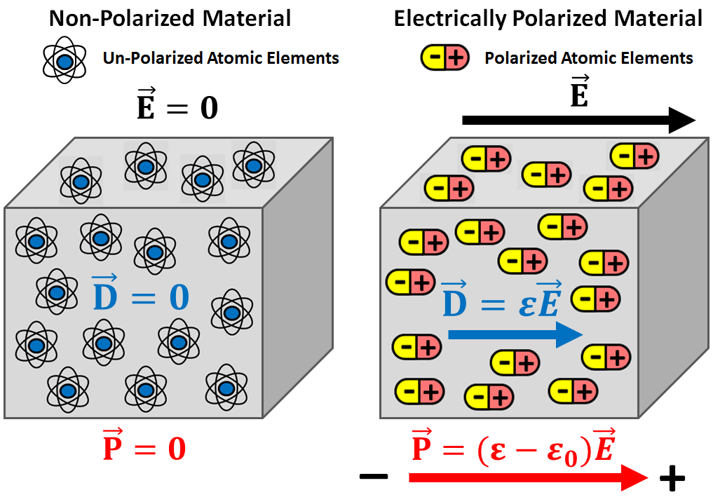
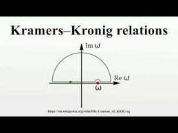

---
title: "1.1.1 Maxwells equation and constitutive relations"
description: "Core electrodynamics concepts used in the GPR forward problem."
weight: 1
math: true
---

## 1.1.1 Maxwell's equations and constitutive relations

전자기파의 거동은 Maxwell 방정식으로 기술된다.

$$
\nabla \times \mathbf{E}(\mathbf{r}, t)= - \frac{\partial \mathbf{B}(\mathbf{r}, t)}{\partial t}
\qquad \text{Maxwell-Faraday's equation}
\tag{1.1}
$$

$$
\nabla \times \mathbf{H}(\mathbf{r}, t)=\frac{\partial \mathbf{D}(\mathbf{r}, t)}{\partial t}
+
\mathbf{J}(\mathbf{r}, t)
\qquad \text{Maxwell-Amp\`ere's equation}
\tag{1.2}
$$

$$
\nabla \cdot \mathbf{D}(\mathbf{r}, t) = q(\mathbf{r}, t)
\qquad \text{Maxwell-Gauss equation (electric)}
\tag{1.3}
$$

$$
\nabla \cdot \mathbf{B}(\mathbf{r}, t) = 0
\qquad \text{Maxwell-Gauss equation (magnetic)}
\tag{1.4}
$$

여기서 $\mathbf{E}$는 전기장으로 단위는 $\mathrm{V/m}$이고, $\mathbf{H}$는 자기장으로 단위는 $\mathrm{A/m}$이다. 또한 $\mathbf{D}$는 전기 유도(electric induction) 또는 전기 변위(electric displacement)로서 단위는 $\mathrm{C/m^2}$이며, $\mathbf{B}$는 자기 유도로서 단위는 $\mathrm{T}$이다. $\mathbf{J}$는 전도 전류 밀도(conduction current density)로 단위는 $\mathrm{A/m^2}$이고, $q$는 전하 밀도(electric charge density)로 단위는 $\mathrm{C/m^3}$이다. 변수 $\mathbf{r}$은 위치 벡터이며 단위는 $\mathrm{m}$, $t$는 시간이며 단위는 $\mathrm{s}$이다. 여기서 등장하는 장과 변수들은 모두 실수값(real quantities)이다.

오른손 법칙에 따르면, Maxwell-Faraday 방정식은 시간에 따라 변하는 자기 유속이 회전하는 전기장을 생성함을 의미한다. 마찬가지로 Maxwell-Amp\`ere 방정식은 전류 또는 시간에 따라 변하는 전기 유속이 회전하는 자기장을 생성함을 의미한다. 또한 Maxwell-Gauss 방정식은 전하 밀도가 전기 플럭스의 원천임을 나타내며, 이에 대응되는 자기 플럭스의 원천은 존재하지 않음을 보여준다.

### 시간 영역 구성 관계식 (constitutive relations)

Maxwell 방정식계는 매우 일반적이지만 그 자체만으로는 미정(under-determined)이다. 예를 들어 $\nabla \cdot \nabla \times = 0$이라는 벡터 항등식을 이용하면, Maxwell-Faraday 방정식의 divergence를 취해
$\nabla \cdot \mathbf{B}=0$을 얻을 수 있다. 마찬가지로 Maxwell-Amp\`ere 방정식의 divergence와 전하보존법칙

$$
\nabla \cdot \mathbf{J}(\mathbf{r}, t)+\frac{\partial q(\mathbf{r}, t)}{\partial t}=0
\tag{1.5}
$$

을 이용하면 $\nabla \cdot \mathbf{D}=q$를 유도할 수 있다. 따라서 실질적으로는 curl 방정식 두 개와 구성 관계식이 핵심이 된다.

수학적으로도 전자기장을 완전히 결정하기 위해서는 추가적인 물질 관계가 필요하다. 물리적으로는 Maxwell 방정식만으로는 GPR로 조사하려는 자연 매질의 특성이 명시적으로 들어 있지 않기 때문이다. 이때 유도 벡터(induction vectors)와 장 벡터(field vectors) 사이를 연결하는 식이 constitutive relations이다.

진공에서는 이 관계가 단순하다.

$$
\mathbf{D}(\mathbf{r}, t)=\varepsilon_0 \mathbf{E}(\mathbf{r}, t)
\tag{1.6}
$$

$$
\mathbf{B}(\mathbf{r}, t)=\mu_0 \mathbf{H}(\mathbf{r}, t)
\tag{1.7}
$$

여기서 $\varepsilon_0 = 8.85 \times 10^{-12}\,\mathrm{F/m}$는 진공의 유전율이고, $\mu_0 = 4\pi \times 10^{-7}\,\mathrm{H/m}$는 진공의 투자율이다.

반면 암석이나 토양과 같은 유전체 물질 매질에서는 전자기적 응답이 더 복잡하다. 전기장 $\mathbf{E}$가 가해지면 물질 내부에서는 분극(polarisation), 즉 결합전하의 전기적 모멘트가 특정 방향으로 정렬되는 현상이 일어난다. 마찬가지로 자기장이 가해지면 자기적 입자들의 자기 모멘트가 정렬되는 자화(magnetisation)가 유도된다. 선형(linear)이고 등방성(isotropic)인 매질에서는 분극 $\mathbf{P}$와 자화 $\mathbf{M}$를 다음과 같이 쓸 수 있다.

$$
\mathbf{P}(\mathbf{r}, t)=\varepsilon_0 \chi_e(\mathbf{r}, t)\ast \mathbf{E}(\mathbf{r}, t)
\tag{1.8}
$$

$$
\mathbf{M}(\mathbf{r}, t)=\mu_0 \chi_m(\mathbf{r}, t)\ast \mathbf{H}(\mathbf{r}, t)
\tag{1.9}
$$

여기서 $\ast$는 시간 컨볼루션(time convolution)을 의미하며, $\chi_e$는 유전 감수율(dielectric susceptibility), $\chi_m$는 자기 감수율(magnetic susceptibility)이다.

따라서 constitutive relations는 다음과 같이 정리된다.

$$
\mathbf{D}(\mathbf{r}, t)=\varepsilon(\mathbf{r}, t)\ast \mathbf{E}(\mathbf{r}, t)
\tag{1.10}
$$

$$
\mathbf{B}(\mathbf{r}, t)=\mu(\mathbf{r}, t)\ast \mathbf{H}(\mathbf{r}, t)
\tag{1.11}
$$

여기서 $\varepsilon=\varepsilon_0(1+\chi_e)$는 매질의 유전율, $\mu=\mu_0(1+\chi_m)$는 매질의 투자율이다.

전도성 매질에서는 추가로 Ohm의 법칙이 필요하다.

$$
\mathbf{J}_c(\mathbf{r}, t)=\sigma(\mathbf{r}, t)\ast \mathbf{E}(\mathbf{r}, t)
\tag{1.12}
$$

여기서 $\sigma$는 전기전도도이다. 전체 전류는 전도 전류와 소스 전류의 합으로 나타난다.

$$
\mathbf{J}(\mathbf{r}, t)=\mathbf{J}_c(\mathbf{r}, t)+\mathbf{J}_s(\mathbf{r}, t)
\tag{1.13}
$$

실제로 $\mathbf{J}_s$는 송신 안테나 위치와 펄스 방사 시간 동안에만 0이 아닌 값을 가진다.

이러한 constitutive relations와 Ohm의 법칙은 매질이 외부 전기장과 자기장에 어떻게 응답하는지를 기술한다. 따라서 $\varepsilon(\mathbf{r}, t)$, $\mu(\mathbf{r}, t)$, $\sigma(\mathbf{r}, t)$는 각각 유전적, 자기적, 전도성 응답을 나타내는 물질 파라미터이다.

이때 몇 가지 중요한 가정을 둔다.

- **선형성(linearity)**: $\varepsilon$, $\mu$, $\sigma$가 외부 장의 크기에 의존하지 않는다.
- **등방성(isotropy)**: 물성은 스칼라이며 방향에 따라 달라지지 않는다.
- **비균질성(heterogeneity)**: 물성은 공간 위치 $\mathbf{r}$에 따라 달라질 수 있다.
- **시간 의존성(time-dependence)**: 실제 자연 매질은 이상적이지 않으므로 응답이 시간 지연과 완화(relaxation)를 포함할 수 있다.

특히 시간 의존성은 인과성(causality)과 연결된다. 즉, 매질의 응답은 원인보다 먼저 나타날 수 없으므로 $\varepsilon(t)$, $\mu(t)$, $\sigma(t)$와 같은 응답 함수는 자극이 가해지기 전에는 0이어야 한다.

GPR FWI에서는 일반적으로 지하 매질의 전기적 성질, 즉 유전율 $\varepsilon$과 전기전도도 $\sigma$에 더 큰 관심이 있다. 자연 매질은 대체로 비자성(non-magnetic)이므로 실제 응용에서는 보통 $\mu=\mu_0$, 즉 상대 투자율 $\mu_r=\mu/\mu_0=1$로 둔다. 반면 상대 유전율은 $\varepsilon_r=\varepsilon/\varepsilon_0$로 정의되며, GPR 해석에서 매우 중요한 파라미터가 된다.

### 시간 영역 파동 방정식

Maxwell-Faraday 방정식과 Maxwell-Amp\`ere 방정식을 constitutive relations와 결합하면 파동 방정식을 얻을 수 있다. 균질(homogeneous), 시간 불변(time-invariant), source-free 매질에서는 다음과 같이 쓸 수 있다.

$$
\nabla^2 u(\mathbf{r}, t)- \varepsilon \mu \frac{\partial^2 u(\mathbf{r}, t)}{\partial t^2}- \sigma \mu \frac{\partial u(\mathbf{r}, t)}{\partial t}
= 0
\tag{1.14}
$$

여기서 $u$는 전기장 혹은 자기장의 성분을 나타낸다. 이 식은 두 가지 중요한 항을 포함한다.

- $\varepsilon \mu \frac{\partial^2 u}{\partial t^2}$: 파동의 전파(propagation)를 나타내는 항
- $\sigma \mu \frac{\partial u}{\partial t}$: 전도성에 의한 손실 및 확산(diffusion)을 나타내는 항

즉 유전율은 전파 특성을, 전도도는 감쇠와 확산 특성을 조절한다.

다만 이 식은 매질이 시간에 따라 변하지 않는다고 가정했을 때에만 깔끔하게 유도된다. 시간 가변(time-varying) 매질에서는 constitutive relation에 시간 컨볼루션이 포함되어 매질 응답이 과거 이력에 의존하게 되므로, 단순한 상수 속도 $v=1/\sqrt{\varepsilon\mu}$를 정의하기 어렵다. 이런 이유로 분산성과 완화 특성을 다루려면 시간 영역보다 주파수 영역이 편리하다.

## 1.1.2 Frequency-domain formulation

시간 조화 의존성(time-harmonic dependency)을 $e^{-i\omega t}$로 정의하면, Fourier 변환은 다음과 같이 쓸 수 있다.

$$
f(\omega) = \int_{-\infty}^{+\infty} f(t)e^{i\omega t}\,dt
\tag{1.15}
$$

$$
f(t) = \frac{1}{2\pi}\int_{-\infty}^{+\infty} f(\omega)e^{-i\omega t}\,d\omega
\tag{1.16}
$$

이 convention에서는 시간 미분이 주파수 영역에서 $-i\omega$ 곱셈으로 바뀐다. 따라서 Maxwell 방정식은 다음과 같은 형태가 된다.

$$
\nabla \times \mathbf{E}(\mathbf{r}, \omega) = i\omega \mathbf{B}(\mathbf{r}, \omega)
\tag{1.17}
$$

$$
\nabla \times \mathbf{H}(\mathbf{r}, \omega) = -i\omega \mathbf{D}(\mathbf{r}, \omega) + \mathbf{J}(\mathbf{r}, \omega)
\tag{1.18}
$$

$$
\nabla \cdot \mathbf{D}(\mathbf{r}, \omega) = q(\mathbf{r}, \omega)
\tag{1.19}
$$

$$
\nabla \cdot \mathbf{B}(\mathbf{r}, \omega) = 0
\tag{1.20}
$$

주파수 영역에서는 시간 영역의 컨볼루션이 단순한 곱셈으로 바뀌므로 constitutive relations와 Ohm의 법칙도 훨씬 간단해진다.

$$
\mathbf{D}(\mathbf{r}, \omega) = \varepsilon(\mathbf{r}, \omega)\mathbf{E}(\mathbf{r}, \omega)
\tag{1.21}
$$

$$
\mathbf{B}(\mathbf{r}, \omega) = \mu(\mathbf{r}, \omega)\mathbf{H}(\mathbf{r}, \omega)
\tag{1.22}
$$

$$
\mathbf{J}_c(\mathbf{r}, \omega) = \sigma(\mathbf{r}, \omega)\mathbf{E}(\mathbf{r}, \omega)
\tag{1.23}
$$

즉 시간 영역에서의 실수 응답 함수는 주파수 영역에서 복소수 함수로 바뀌며, 이 복소수의 실수부와 허수부는 각각 저장 성분과 손실 성분을 반영한다. 또한 주파수 의존성은 분산(dispersion)을 의미한다.

주파수 영역에서는 전파 항과 확산 항을 유효 유전율(effective permittivity)로 묶어 Helmholtz equation 형태로 쓸 수 있다.

$$
\nabla^2 u(\mathbf{r}, \omega) + \varepsilon_e(\omega)\mu(\omega)\omega^2 u(\mathbf{r}, \omega)=0
\tag{1.24}
$$

여기서

$$
\varepsilon_e(\omega)=\varepsilon(\omega)+\frac{i\sigma(\omega)}{\omega}
\tag{1.25}
$$

는 유전율과 전도도를 함께 포함한 effective permittivity이다. 따라서 주파수 영역에서는 각 주파수별로 Helmholtz equation을 푸는 방식으로 분산성과 감쇠를 다룰 수 있다.

한편, 인과성(causality)을 만족하려면 주파수 영역 물성의 실수부와 허수부는 **Kramers–Kronig** 관계로 연결되어야 한다(상호 종속). 즉 실제 자연 매질의 전자기 파라미터는 원칙적으로 전 주파수 대역에서 상수일 수 없으며, 주파수 의존성을 갖는다. 다만 실제 GPR 계측은 제한된 주파수 대역에서 이루어지므로, 실용적으로는 일정 대역 내에서 물성을 상수로 근사하는 경우가 많다.

마지막으로 inversion 관점에서는 frequency-independent하고 real-valued인 permittivity와 conductivity만을 복원 대상으로 두는 경우가 많다. 이는 dispersion까지 포함하면 자유도와 ill-posedness가 크게 증가하기 때문이다. 실제로 많은 GPR 데이터는 permittivity에는 민감하지만 conductivity와 dispersion에는 상대적으로 덜 민감하므로, 단순화된 파라미터화가 실용적이다.

### 추가 정리
Kramers-Kroing 관계 : 어떤 매질의 복소 응답 함수에서 실수부와 허수부가 서로 독립이 아니다.
$\rightarrow$ 전 주파수 대역에서 실수부를 알면 허수부도 정해지고 허수부를 알면 실수부가 정해진다.

물리적인 시스템은 원인보다 결과가 먼저 나올 수 없다. 예를 들어 전기장$\mathbf{E}(t)$를 가했을 때 미질의 분국 $\mathbf{P}(t)$가 생긴다고 하자. 정상적인 매질이면, 전기장을 가하기 전에 분극이 생기면 안된다. 즉 시간영역 응답 함수는

$$h(t) = 0 \quad (t<0)$$

를 만족해야 한다.

이 조건이 푸리에 변환을 거치면 주파수 영역에서 실수부와 허수부를 연결하는 적분관계로 바뀌게 된다.

**proof**
시간 영역 선형 응답을
$$y(t) = \int_{-\infty}^{\infty}h(\tau)x(t-\tau)d\tau$$
라고 쓰자. 여기서 h(t)는 시스템의 impulse response다.

인과성을 만족하면
$$h(t) = 0 \quad (t<0)$$
이어야 한다. 즉 응답은 과거 입력에만 의존한다. 그러면 푸리에 변환으로 정의한 주파수 응답은
$$H(\omega) = \int_{0}^{\infty}h(t)e^{iwt}dt$$
가 된다.

이제 $\omega$를 복소수 $z = \omega + i\eta$로 확장해서 생각하자.
$$H(z) = \int_{0}^{\infty}h(t)e^{izt}dt$$
그런데 
$$e^{izt} = e^{iwt}e^{-\eta t}$$ 이므로, $\eta >0$(복소좌표계 상반평면)이면 적분이 잘 수렴한다.(= 해석적이다.)

상반평면에 대해 cauchy 적분을 취해주면 다음과 같은 관계가 성립한다.

$$f(z_0) = \frac{1}{2\pi i}\oint_C \frac{f(z)}{z-z_0}dz$$
("해석적 함수는 경계 위 정보만 알면 내부의 값도 적분을 통해 정해진다.")

**Cauchy 적분 증명하기**
이때 $z = z_0$에서 값이 발산하므로 적분을 아래와 같은 폐곡면으로 수행해줘야 한다(singularity를 피함). 원이 무한히 크다고 가정하자.
그럼 적분 구간이 세부분으로 나뉜다.
1. 실축 부분
2. 큰 반원 부분
3. $\omega$주변 작은 반원 부분

    

먼저 여기서 큰 반원 부분의 적분은 0이 된다.
(엄밀한 설명은 제공 못하지만 |$z-z_0| \sim r \rightarrow \infty$ 이므로 적분값이 0이 되는걸 직관할 수 있다.)

또한 $\omega$ 주변의 작은 반원을 
$$z = w + \epsilon e^{i\theta}, \quad \theta: \pi \rightarrow 0$$처럼 시계 방향으로 돈다고 할때 
$$ dz = i\epsilon e^{i\theta}d\theta, \quad z-w = \epsilon e^{i\theta}$$ 이므로
$$\int_{C_\epsilon}\frac{H(z)}{z - w} \sim H(w)\int_{\pi}^{0}
\frac{i\epsilon e^{i\theta}}{\epsilon e^{i\theta}}d\theta = H(w)\int_{\pi}^{0}id\theta = -i\pi H(w)$$가 된다. 시계방향으로 돌았기 때문에 

Cauchy's theorem에 의해 전체 contour 적분은 0이므로,

$$\mathcal{P}\int_{-\infty}^{\infty}\frac{H(\omega')}{\omega'-\omega}\,d\omega'+\int_{C_\varepsilon}\frac{H(z)}{z-\omega}\,dz=0$$

이고, 작은 반원 \(C_\varepsilon\)에서의 적분이

$$
\int_{C_\varepsilon}\frac{H(z)}{z-\omega}\,dz
\approx -\,i\pi H(\omega)
$$

이므로 이를 대입하면

$$
\mathcal{P}\int_{-\infty}^{\infty}\frac{H(\omega')}{\omega'-\omega}\,d\omega'-i\pi H(\omega)=0
$$

따라서

$$
\mathcal{P}\int_{-\infty}^{\infty}\frac{H(\omega')}{\omega'-\omega}\,d\omega'=i\pi H(\omega)
$$

즉

$$
H(\omega)=\frac{1}{i\pi}\mathcal{P}\int_{-\infty}^{\infty}\frac{H(\omega')}{\omega'-\omega}\,d\omega'=
-\frac{i}{\pi}
\mathcal{P}\int_{-\infty}^{\infty}
\frac{H(\omega')}{\omega'-\omega}\,d\omega'
$$

를 얻는다.(Cauchy 적분 증명 完)

**Kramers-Kroing 증명**
$$
H(\omega)=H'(\omega)+iH''(\omega)
$$

로 실수부와 허수부를 분리한후 코시 적분식에 대입하면

$$
H'(\omega)+iH''(\omega)=-\frac{i}{\pi}\,\mathcal{P}\int_{-\infty}^{\infty}
\frac{H'(\omega')+iH''(\omega')}{\omega'-\omega}\,d\omega'
$$

이다.

우변을 전개하면

$$
-\frac{i}{\pi}\,\mathcal{P}\int_{-\infty}^{\infty}
\frac{H'(\omega')}{\omega'-\omega}\,d\omega'+
\frac{1}{\pi}\,
\mathcal{P}\int_{-\infty}^{\infty}
\frac{H''(\omega')}{\omega'-\omega}\,d\omega'
$$

이므로,

$$
H'(\omega)+iH''(\omega)=\frac{1}{\pi}\,\mathcal{P}\int_{-\infty}^{\infty}\frac{H''(\omega')}{\omega'-\omega}\,d\omega'-
\frac{i}{\pi}\,
\mathcal{P}\int_{-\infty}^{\infty}
\frac{H'(\omega')}{\omega'-\omega}\,d\omega'
$$

이제 실수부와 허수부를 각각 비교하면,

$$
H'(\omega)=\frac{1}{\pi}\,
\mathcal{P}\int_{-\infty}^{\infty}
\frac{H''(\omega')}{\omega'-\omega}\,d\omega'
$$

$$
H''(\omega)=-\frac{1}{\pi}\,
\mathcal{P}\int_{-\infty}^{\infty}
\frac{H'(\omega')}{\omega'-\omega}\,d\omega'
$$

다음을 통해 실수부와 허수부가 상호 종속적임을 확인할 수 있다.

